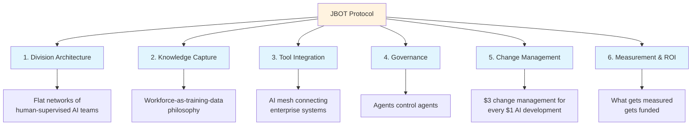

# JBOT Protocol

**Building AI-Native Organizations That Scale Without Proportional Headcount**

By Joaquin Abondano | [v2.0](CHANGELOG.md)

---

## Table of Contents

- [What This Is](#what-this-is)
- [Quick Start](#quick-start)
- [The 6 Pillars](#the-6-pillars)
- [Implementation Guides](#implementation-guides)
- [Repository Structure](#repository-structure)
- [About the Author](#about-the-author)
- [Contributing](#contributing)
- [License](#license)

---

## What This Is

A battle-tested methodology for deploying AI agents across enterprise operating divisions. Developed while scaling operations at a publicly-traded smart eyewear company.

**The Core Insight:** AI succeeds when it's built by someone who's actually done the work — and knows what makes it fulfilling.

**New to the framework?** Start with the [Getting Started Guide](guides/getting-started.md) — zero to first agent in 30 minutes.

---

## Quick Start

1. **Read** the [6 Pillars](#the-6-pillars) below (2 minutes)
2. **Fill out** a [Division Template](templates/DIVISION.md) for your target team (10 minutes)
3. **Document** your top 3 processes using [PROCESSES.md](templates/PROCESSES.md) (10 minutes)
4. **Choose** an implementation path: [Claude Code](implementation/claude-code-guide.md) or [OpenClaw](implementation/openclaw-fleet.md)
5. **Start read-only** — validate agent accuracy before granting write access

See the full [Getting Started Guide](guides/getting-started.md) for the complete walkthrough.

---

## The 6 Pillars



| # | Pillar | Focus |
|---|--------|-------|
| 1 | [**Division Architecture**](framework/01-division-architecture.md) | Flat networks of human-supervised AI teams |
| 2 | [**Knowledge Capture**](framework/02-knowledge-capture.md) | Workforce-as-training-data philosophy |
| 3 | [**Tool Integration**](framework/03-tool-integration.md) | AI mesh connecting enterprise systems via MCP |
| 4 | [**Governance**](framework/04-governance.md) | Agents control agents — layered oversight |
| 5 | [**Change Management**](framework/05-change-management.md) | $3 change management for every $1 AI development |
| 6 | [**Measurement & ROI**](framework/06-measurement-roi.md) | What gets measured gets funded |

---

## Implementation Guides

Two battle-tested deployment paths:

### Claude Code

Deploy agents using Anthropic's CLI with CLAUDE.md configuration files, MCP servers, hooks, and subagents. Best for teams already in the Claude ecosystem.

See [implementation/claude-code-guide.md](implementation/claude-code-guide.md)

### OpenClaw Fleet

Self-hosted multi-agent fleet with Telegram, phone IVR, and persistent division agents. Best for always-on operations with messaging integrations.

| Agent | Division | Functions |
|-------|----------|-----------|
| jbot | Executive | Email, calendar, delegation, phone IVR |
| shipbot | Fulfillment | Order tracking, inventory, late alerts |
| mktgbot | Marketing | Campaign performance, content drafting |
| salesbot | Sales | CRM, pipeline tracking, lead scoring |
| financebot | Finance | Revenue dashboards, board reports |

See [implementation/openclaw-fleet.md](implementation/openclaw-fleet.md)

### Model Selection

Not every task needs the most powerful model. Route by complexity and stakes to reduce costs 60-70%.

See [implementation/model-selection-guide.md](implementation/model-selection-guide.md)

---

## Repository Structure

```
/framework                              # The 6 Pillars
  ├── 01-division-architecture.md       Org mapping, agent topology, team patterns
  ├── 02-knowledge-capture.md           Interview guides, process mining, decision journals
  ├── 03-tool-integration.md            MCP deep-dive, integration spectrum, system catalog
  ├── 04-governance.md                  Decision matrix, escalation, audit framework
  ├── 05-change-management.md           Adoption curve, RACI matrix, training levels
  └── 06-measurement-roi.md             ROI calculation, HAR metric, dashboarding

/implementation                         # Deployment Guides
  ├── openclaw-fleet.md                 Self-hosted multi-agent fleet
  ├── claude-code-guide.md              Claude Code + CLAUDE.md hierarchy
  └── model-selection-guide.md          Haiku/Sonnet/Opus routing & cost analysis

/templates                              # Reusable Templates
  ├── DIVISION.md                       Document any business division
  ├── PROCESSES.md                      Standard operating procedures
  ├── SYSTEMS.md                        Software & tool documentation
  ├── CUSTOM-INSTRUCTIONS.md            Claude Project instructions
  ├── AGENT-SKILL.md                    Agent skill definition (RFC 2119)
  └── discovery-interview.md            Client discovery questions

/case-studies                           # Real-World Evidence
  └── anonymized-implementation.md      Public hardware company case study

/guides                                 # Getting Started
  └── getting-started.md                Zero to first agent in 30 minutes

/research                               # Background Research
  └── enterprise-agentic-ai-guide.md    McKinsey, Deloitte, MIT CISR synthesis

/lead-magnet                            # Marketing
  └── playbook-outline.md              Downloadable PDF outline
```

---

## About the Author

Joaquin Abondano is COO at Innovative Eyewear Inc. (NASDAQ: LUCY), where he built this framework while scaling AI-native operations across 7 divisions.

- Website: [jabondano.co](https://jabondano.co)
- LinkedIn: [/in/jabondano](https://linkedin.com/in/jabondano)
- GitHub: [jabondano](https://github.com/jabondano)

---

## Contributing

Found an error? Have a suggestion? See [CONTRIBUTING.md](CONTRIBUTING.md) for guidelines.

---

## License

© 2025-2026 Joaquin Abondano. All rights reserved.

Framework concepts may be referenced with attribution. Commercial use requires written permission. See [LICENSE.md](LICENSE.md) for details.
