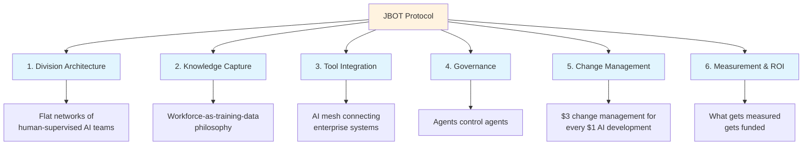

# JBOT Protocol

**Building AI-Native Organizations That Scale Without Proportional Headcount**

By Joaquin Abondano | [v2.2](CHANGELOG.md)

---

## Table of Contents

- [What This Is](#what-this-is)
- [Quick Start](#quick-start)
- [The 6 Pillars](#the-6-pillars)
- [Implementation Guides](#implementation-guides)
- [Repository Structure](#repository-structure)
- [About the Author](#about-the-author)
- [Contributing](#contributing)
- [License](#license)

---

## What This Is

A battle-tested methodology for deploying AI agents across enterprise operating divisions. Developed while scaling operations at a publicly-traded smart eyewear company.

**The Core Insight:** AI succeeds when it's built by someone who's actually done the work — and knows what makes it fulfilling.

**New to the framework?** Start with the [Getting Started Guide](guides/getting-started.md) — zero to first agent in 30 minutes.

---

## Quick Start

1. **Read** the [6 Pillars](#the-6-pillars) below (2 minutes)
2. **Fill out** a [Division Template](templates/DIVISION.md) for your target team (10 minutes)
3. **Document** your top 3 processes using [PROCESSES.md](templates/PROCESSES.md) (10 minutes)
4. **Choose** an implementation path: [Claude Code](implementation/claude-code-guide.md) or [OpenClaw](implementation/openclaw-fleet.md)
5. **Start read-only** — validate agent accuracy before granting write access

See the full [Getting Started Guide](guides/getting-started.md) for the complete walkthrough.

---

## The 6 Pillars


```mermaid
graph TD
    JP[JBOT Protocol] --> P1[1. Division Architecture]
    JP --> P2[2. Knowledge Capture]
    JP --> P3[3. Tool Integration]
    JP --> P4[4. Governance]
    JP --> P5[5. Change Management]
    JP --> P6[6. Measurement & ROI]

    P1 --> P1D["Flat networks of<br/>human-supervised AI teams"]
    P2 --> P2D["Workforce-as-training-data<br/>philosophy"]
    P3 --> P3D["AI mesh connecting<br/>enterprise systems"]
    P4 --> P4D["Agents control agents"]
    P5 --> P5D["$3 change management for<br/>every $1 AI development"]
    P6 --> P6D["What gets measured<br/>gets funded"]

    style JP fill:#fff3e0
    style P1 fill:#e1f5fe
    style P2 fill:#e1f5fe
    style P3 fill:#e1f5fe
    style P4 fill:#e1f5fe
    style P5 fill:#e1f5fe
    style P6 fill:#e1f5fe
```

| # | Pillar | Focus |
|---|--------|-------|
| 1 | [**Division Architecture**](framework/01-division-architecture.md) | Flat networks of human-supervised AI teams |
| 2 | [**Knowledge Capture**](framework/02-knowledge-capture.md) | Workforce-as-training-data philosophy |
| 3 | [**Tool Integration**](framework/03-tool-integration.md) | AI mesh connecting enterprise systems via MCP |
| 4 | [**Governance**](framework/04-governance.md) | Agents control agents — layered oversight |
| 5 | [**Change Management**](framework/05-change-management.md) | $3 change management for every $1 AI development |
| 6 | [**Measurement & ROI**](framework/06-measurement-roi.md) | What gets measured gets funded |

---

## Implementation Guides

Two battle-tested deployment paths:

### Claude Code

Deploy agents using Anthropic's CLI with CLAUDE.md configuration files, MCP servers, hooks, and subagents. Best for teams already in the Claude ecosystem.

See [implementation/claude-code-guide.md](implementation/claude-code-guide.md)

### OpenClaw Fleet

Self-hosted multi-agent fleet with Telegram, phone IVR, and persistent division agents. Best for always-on operations with messaging integrations.

| Agent | Division | Functions |
|-------|----------|-----------|
| opsbot | Operations | Supply chain, freight, vendor intel |
| shipbot | Fulfillment | Order tracking, inventory, late alerts |
| mktgbot | Marketing | Campaign performance, content drafting |
| salesbot | Sales | CRM, pipeline tracking, lead scoring |
| financebot | Finance | Revenue dashboards, board reports |
| sysbot | Systems | Fleet monitoring, cost watchdog |

> **Topology note (June 2026):** the reference fleet originally ran hub-and-spoke around an executive hub bot. The hub was retired and its functions redistributed to the specialists — a deliberate decommissioning that surfaced its own lessons (every signal needs a consumer that survives the producer; see Pillar 4, Decommissioning & Succession). The protocol now recommends flat specialist topologies with a shared signal layer over executive-hub designs.

See [implementation/openclaw-fleet.md](implementation/openclaw-fleet.md)

### Model Selection

Not every task needs the most powerful model. Route by complexity and stakes to reduce costs 60-70%.

See [implementation/model-selection-guide.md](implementation/model-selection-guide.md)

---

## Systems & Protocols (v2.2 — June 2026)

The framework now ships two layers above the pillars:

**Protocols** are named, reusable methodologies — the [Copilot Pattern](protocols/copilot-pattern/) (ad hoc single-purpose tools with proportional governance) and the [ICP Intelligence Engine](protocols/icp-intelligence-engine/) (self-refreshing customer profiles).

**Systems** are pre-built, configurable implementations — not tools, not prompts, but complete operating systems extracted from production deployments and packaged with intake questionnaires, configuration schemas, and worked examples:

| System | What it runs |
|--------|--------------|
| [Inventory Watchdog](systems/inventory-watchdog/) | Stock-level alerts, late-order detection, reorder recommendations |
| [Sales Pipeline Engine](systems/sales-pipeline-engine/) | Pipeline hygiene, stale-deal detection, daily/weekly reports |
| [Static Content Engine](systems/static-content-engine/) | QA-scored content generation with auto-routing thresholds |
| [Marketing Performance Monitor](systems/marketing-performance-monitor/) | Cross-channel spend and performance alerting |

Each system has been deployed at a real company, anonymized, and extracted into universal patterns. Fill out the system's `config/intake-v1.md`, adapt an example config, deploy on your fleet.

---

## Lattice Architecture (v2 — March 2026)

The framework has evolved significantly since v1. The 6 pillars remain valid. What's been added is a production-grade architecture for running 10+ agents continuously — shared signal layer, three-tier memory, model cost pyramid, and async consensus patterns.

→ **[Read the Lattice Architecture doc](docs/LATTICE-ARCHITECTURE.md)**

---

## Repository Structure

```
/framework                              # The Pillars (Phase 0 → 6, plus extensions)
  ├── 00-phase-0-research-methodology.md  Pre-deployment research, the Gap Map
  ├── 01-division-architecture.md       Org mapping, agent topology, team patterns
  ├── 02-knowledge-capture.md           Interview guides, process mining, decision journals
  ├── 03-tool-integration.md            MCP deep-dive, native-first check, failure modes
  ├── 04-governance.md                  Escalation, kill hierarchy, decommissioning, trust zones
  ├── 05-change-management.md           Adoption curve, RACI matrix, training levels
  ├── 06-measurement-roi.md             ROI calculation, HAR metric, dashboarding
  ├── 07-agent-identity.md              SOUL/MEMORY/schedule three-file architecture
  └── 08-evolution-layer.md             Systems that improve themselves over time

/protocols                              # Named, Reusable Methodologies
  ├── copilot-pattern/                  Ad hoc single-purpose tools, governed proportionally
  ├── icp-intelligence-engine/          Self-refreshing customer-profile pipeline (6 agents)
  └── pricing-framework/                Engagement pricing methodology

/systems                                # Pre-Built, Configurable Systems
  ├── inventory-watchdog/               Stock alerts, late orders, reorder recommendations
  ├── sales-pipeline-engine/            Pipeline hygiene, stale-deal detection, weekly reports
  ├── static-content-engine/            QA-scored ad/content generation at volume
  └── marketing-performance-monitor/    Cross-channel spend and performance alerts

/implementation                         # Deployment Guides
  ├── openclaw-fleet.md                 Self-hosted multi-agent fleet
  ├── claude-code-guide.md              Claude Code + CLAUDE.md hierarchy
  └── model-selection-guide.md          Four-tier model routing & cost analysis

/docs                                   # Architecture Deep-Dives
  ├── LATTICE-ARCHITECTURE.md           Shared signal layer, three-tier memory
  ├── DISCORD-ARCHITECTURE.md           Channel architecture for fleet operations
  ├── GAP-ANALYSIS.md                   Protocol vs production-proven patterns
  └── MAINTENANCE.md                    How this repo stays current with live operations

/templates                              # Reusable Templates
  ├── DIVISION.md                       Document any business division
  ├── PROCESSES.md                      Standard operating procedures
  ├── SYSTEMS.md                        Software & tool documentation
  ├── CUSTOM-INSTRUCTIONS.md            Claude Project instructions
  ├── AGENT-SKILL.md                    Agent skill definition (RFC 2119)
  ├── copy-brief.md                     Ad creative copy brief
  ├── discord-design-generator.md       Intake → Discord architecture
  └── discovery-interview.md            Voice-first discovery → Master Context File

/case-studies                           # Real-World Evidence
  ├── anonymized-implementation.md      Public hardware company case study
  ├── b2b-lead-gen-system.md            B2B lead gen with ICP scoring & outreach
  ├── executive-operations-fleet.md     Autonomous executive ops fleet (4-bot architecture)
  └── family-operations-bot.md          Family AI bot built with a 12-year-old (personal scale)

/industry-templates                     # Vertical-Specific Blueprints
  ├── README.md                         Index and usage guide
  ├── real-estate-brokerage.md          Residential brokerage automation
  ├── import-export-distribution.md     Consumer goods import/distribution
  └── manufacturing-operations.md       Vertically integrated manufacturing

/guides                                 # How-To Guides
  ├── getting-started.md                Zero to first agent in 30 minutes
  ├── discord-server-deployment.md      Fleet channels + 10 live-deployment lessons
  └── ad-creative-workflow.md           AI ad creative production workflow

/research                               # Background Research
  ├── enterprise-agentic-ai-guide.md    McKinsey, Deloitte, MIT CISR synthesis
  └── sector-research-starter.md        Per-sector research starting points

/lead-magnet                            # Marketing
  └── playbook-outline.md              Downloadable PDF outline
```

---

## About the Author

Joaquin Abondano is COO at Innovative Eyewear Inc. (NASDAQ: LUCY), where he built this framework while scaling AI-native operations across 7 divisions.

- Website: [jabondano.co](https://jabondano.co)
- LinkedIn: [/in/jabondano](https://linkedin.com/in/jabondano)
- GitHub: [jabondano](https://github.com/jabondano)

---

## Contributing

Found an error? Have a suggestion? See [CONTRIBUTING.md](CONTRIBUTING.md) for guidelines.

---

## License

© 2025-2026 Joaquin Abondano. All rights reserved.

Framework concepts may be referenced with attribution. Commercial use requires written permission. See [LICENSE.md](LICENSE.md) for details.
