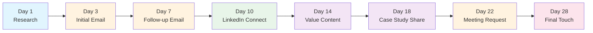
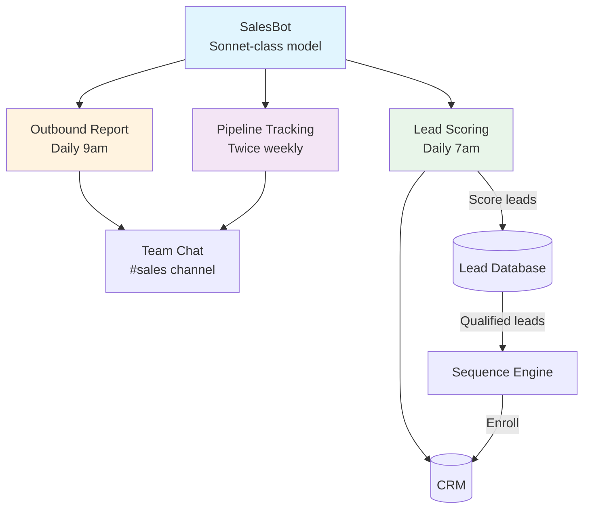
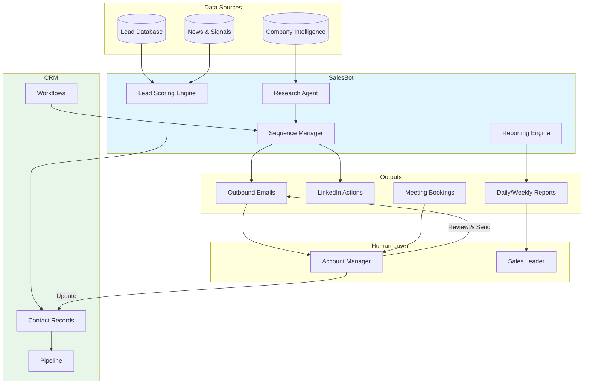

# Case Study: AI-Powered B2B Lead Generation System

**Anonymized implementation of the JBOT Protocol for outbound sales automation**

---

## Company Profile

| Attribute | Detail |
|-----------|--------|
| **Industry** | Consumer electronics / wearable technology |
| **Size** | 30-50 employees |
| **Revenue** | ~$3-5M annually |
| **Sales model** | Primarily DTC (e-commerce), nascent wholesale channel |
| **Challenge** | Expand into B2B/wholesale with zero dedicated outbound sales reps |

## The Challenge

The company had built a successful direct-to-consumer brand but was leaving significant revenue on the table in B2B channels. Their product line — durable, tech-enhanced personal accessories — had clear applications in corporate safety programs, employee wellness initiatives, and specialty retail.

**Key constraints:**
1. **No outbound sales function** — The team had 1.5 account managers handling inbound wholesale inquiries only
2. **No ICP definition** — "Anyone who wants to buy 50+ units" was the closest thing to a target customer profile
3. **No outreach infrastructure** — No sequences, no templates, no CRM pipeline for outbound
4. **No budget for SDRs** — Leadership wanted to prove the channel before hiring dedicated headcount
5. **Brand protection** — As a public company, outreach quality had to be impeccable

The question: **Could an AI agent system build and run a B2B outbound function from scratch?**

---

## The Approach

### Phase 0: ICP Research & Architecture (Week 1-2)

Before writing a single line of automation, we invested two weeks in ICP research. The team analyzed their existing wholesale customers (inbound), identified patterns, and built a scoring model.

#### ICP Scoring Model: 5-Factor Weighted Framework

| Factor | Weight | Scoring Criteria | Data Source |
|--------|:------:|-------------------|-------------|
| **Industry Fit** | 30% | Target verticals: industrial safety, corporate wellness, specialty retail, outdoor recreation | Company website, LinkedIn |
| **Company Size** | 20% | Sweet spot: 50-500 employees (large enough for volume, small enough for fast decisions) | LinkedIn, public filings |
| **Technology Readiness** | 20% | Existing tech adoption signals: smart PPE, IoT programs, innovation budgets | Website, press releases, job postings |
| **Geographic Proximity** | 15% | Regional accounts close faster and have lower logistics cost; prioritize domestic + key metros | Company HQ location |
| **Buying Signals** | 15% | Active RFPs, safety program expansions, recent funding, leadership changes | News alerts, job boards, LinkedIn activity |

**Scoring scale:** Each factor rated 1-5, multiplied by weight. Total score 0-5.

| Score Range | Classification | Action |
|:-----------:|---------------|--------|
| 4.0-5.0 | **Tier 1 — Hot** | Personalized multi-touch sequence, priority research |
| 3.0-3.9 | **Tier 2 — Warm** | Standard sequence with light personalization |
| 2.0-2.9 | **Tier 3 — Nurture** | Add to newsletter, revisit quarterly |
| < 2.0 | **Disqualified** | Do not pursue |

### Phase 1: Outreach Sequence Design (Week 2-3)

We designed an 8-touch outreach sequence executed over 28 days. Each touch was templatized but required personalization tokens that the AI agent would fill based on research.

#### The 8-Touch Sequence



| Touch | Day | Channel | Purpose | Personalization Depth |
|:-----:|:---:|---------|---------|:---------------------:|
| 1 | 1 | Internal | Deep research on company, decision-makers, recent news | N/A (prep work) |
| 2 | 3 | Email | Personalized cold email referencing specific pain point or initiative | High |
| 3 | 7 | Email | Follow-up with additional angle; reference industry trend | Medium |
| 4 | 10 | LinkedIn | Connection request with short personalized note | Medium |
| 5 | 14 | Email | Share relevant content (blog post, whitepaper, ROI calculator) | Low |
| 6 | 18 | Email | Share anonymized case study showing results for similar company | Medium |
| 7 | 22 | Email | Direct meeting request with specific value proposition and calendar link | High |
| 8 | 28 | Email | Breakup email — final touch with open door to reconnect later | Low |

**Key design decisions:**
- **Research-first:** Touch 1 is pure prep. The agent spends time understanding the prospect before any outreach
- **Multi-channel:** LinkedIn breaks the email monotony and builds social proof
- **Value-led:** Touches 5-6 provide value before asking for anything
- **Clean exit:** Touch 8 is a breakup email — professional, no desperation, leaves the door open

### Phase 2: Bot Architecture & CRM Setup (Week 3-4)

#### SalesBot Configuration

A single SalesBot agent was deployed with three scheduled capabilities:



**Scheduled jobs:**

| Job | Schedule | Function |
|-----|----------|----------|
| Lead Scoring | Daily 7:00 AM | Score new leads against ICP model, update CRM properties, flag Tier 1 leads |
| Outbound Report | Daily 9:00 AM | Summarize previous day's outreach activity, reply tracking, pipeline changes |
| Pipeline Report | Mon + Thu 2:00 PM | Full pipeline snapshot: leads by stage, conversion rates, revenue forecast |

#### CRM Integration Pattern

Rather than building a custom CRM, we extended the existing one with outbound-specific customizations:

**Custom properties added (15):**

| Property Group | Properties |
|---------------|-----------|
| ICP Scoring | `icp_score`, `industry_fit`, `company_size_fit`, `tech_readiness`, `geo_proximity`, `buying_signals` |
| Outreach Tracking | `sequence_stage`, `sequence_start_date`, `last_touch_date`, `next_touch_date`, `outreach_channel` |
| Qualification | `qualification_status`, `disqualification_reason`, `meeting_booked_date`, `deal_value_estimate` |

**Dedicated pipeline:** "Outbound Prospecting" with stages:

| Stage | Probability | Exit Criteria |
|-------|:-----------:|---------------|
| New Lead | 5% | ICP scored, research complete |
| Contacted | 10% | First outreach sent |
| Engaged | 25% | Prospect replied (any response) |
| Meeting Booked | 40% | Calendar invite confirmed |
| Proposal Sent | 60% | Formal quote delivered |
| Negotiation | 75% | Active back-and-forth on terms |
| Closed Won | 100% | PO received |
| Closed Lost | 0% | Explicit decline or 90-day no-response |

**Automated workflows:**
1. **Lead scoring trigger** — New contact created with source = "outbound" auto-triggers ICP scoring
2. **Sequence enrollment** — Tier 1 and Tier 2 leads auto-enroll in outreach sequence
3. **Reply detection** — Incoming email from sequenced contact pauses the sequence and alerts the human rep
4. **Stale lead cleanup** — Leads with no engagement after Touch 8 auto-move to "Closed Lost"

---

## The Pilot Framework

### Design: 50-Lead Test Batch

Rather than scaling immediately, we designed a controlled pilot:

| Parameter | Value | Rationale |
|-----------|-------|-----------|
| **Batch size** | 50 leads | Small enough for quality review, large enough for statistical signals |
| **Duration** | 30 days | Full sequence cycle (28 days) plus 2-day buffer |
| **Verticals** | 2 target industries | Test ICP hypothesis in two different markets |
| **Human oversight** | 100% email review | Every outgoing email reviewed by human before send during pilot |
| **Success criteria** | Defined before launch | Reply rate, meeting rate, pipeline value generated |

### Pilot Execution Workflow

```
Week 1: Score 50 leads → Human reviews scores → Approve/adjust → Enroll in sequence
Week 2: Touches 1-3 execute → Monitor replies → Adjust templates based on response patterns
Week 3: Touches 4-6 execute → LinkedIn connections → Value content delivery
Week 4: Touches 7-8 execute → Meeting requests → Breakup emails → Compile results
```

### Results Framework

| Metric | Pilot Target | Industry Benchmark | Actual (Template) |
|--------|:-----------:|:------------------:|:-----------------:|
| **Email open rate** | 40-50% | 25-35% | ___% |
| **Reply rate** | 15-25% | 8-15% | ___% |
| **Positive reply rate** | 8-12% | 3-5% | ___% |
| **Meeting conversion** | 5-10% | 2-5% | ___% |
| **Pipeline value generated** | $50-100K | Varies | $___ |
| **Cost per meeting** | <$50 | $200-500 (SDR model) | $___ |
| **Sequence completion rate** | 85%+ | 70-80% | ___% |

**Why these targets beat benchmarks:** AI-driven research enables deeper personalization than a human SDR can deliver at scale. The research step (Touch 1) takes the agent 2-3 minutes per lead — a human SDR typically spends 30 seconds.

---

## Lessons Learned

### 1. Data Quality Is the Bottleneck

The lead scoring model is only as good as the data feeding it. Initial lead lists from generic B2B databases had 30-40% inaccurate contact information. We learned to:
- **Validate emails before sequencing** (bounce rate kills sender reputation)
- **Cross-reference multiple sources** for company data (LinkedIn + website + news)
- **Build a rejection feedback loop** — bounced emails and wrong contacts feed back into data quality scoring for the source

### 2. Personalization Depth Drives Reply Rates

The difference between a 10% and 25% reply rate was almost entirely attributable to personalization quality:

| Personalization Level | Example | Reply Rate |
|----------------------|---------|:----------:|
| **None** | "Dear Safety Manager, I'd like to introduce..." | 3-5% |
| **Light** | "Hi [Name], I noticed [Company] is in the safety equipment space..." | 8-12% |
| **Deep** | "Hi [Name], I saw [Company]'s recent expansion into the Southeast region and your new warehouse safety initiative..." | 18-25% |

The AI agent excelled at deep personalization because it could process company websites, recent news, LinkedIn posts, and job listings in minutes — producing research briefs that would take a human SDR 15-20 minutes per lead.

### 3. Timing of Touches Matters More Than Volume

Early iterations had touches too close together (every 2 days). This felt aggressive and generated negative replies. The final 28-day cadence with variable spacing performed significantly better:
- **Days 1-7:** Relatively dense (3 touches) — capitalize on initial research freshness
- **Days 7-18:** Moderate spacing — shift to value delivery
- **Days 18-28:** Wider spacing — meeting request and clean exit

### 4. Human-in-the-Loop Is Non-Negotiable for Brand-Sensitive Outreach

During the pilot, human review caught several issues:
- Tone mismatches (too casual for a Fortune 500 prospect, too formal for a startup)
- Factual errors in company research (agent confused two similarly-named companies)
- Sensitive timing (one prospect's company was going through layoffs — not the right time for a cold email)

**Recommendation:** Keep 100% human review during pilot. Move to spot-check (20-30%) once templates and scoring are validated. Never go fully autonomous on outbound email for a public company.

### 5. The Agent Does Research, The Human Does Relationships

The most effective model was:
- **Agent handles:** Lead sourcing, scoring, research, template generation, scheduling, reporting
- **Human handles:** Final email review, meeting conversations, relationship building, deal negotiation

This division leverages AI's strengths (data processing, consistency, speed) while preserving the human elements that actually close deals (empathy, judgment, trust-building).

---

## Architecture Diagram: Full System



---

## Applicability

This pattern works for any organization that:
- Has a proven product with B2B potential but no outbound sales function
- Needs to validate B2B demand before investing in dedicated headcount
- Values brand protection and quality over blast-volume outreach
- Has existing CRM infrastructure that can be extended (not replaced)

**Not recommended for:**
- Companies with mature, high-volume outbound operations (they need optimization, not foundation-building)
- Highly regulated industries where outreach content requires legal review of every message
- Products with average deal sizes under $1,000 (the personalization ROI doesn't justify the effort)

---

## Related Resources

- [JBOT Protocol — Division Architecture](../framework/01-division-architecture.md)
- [JBOT Protocol — Tool Integration](../framework/03-tool-integration.md)
- [Agent Skill Template](../templates/AGENT-SKILL.md)
- [Anonymized Fleet Implementation](./anonymized-implementation.md)
