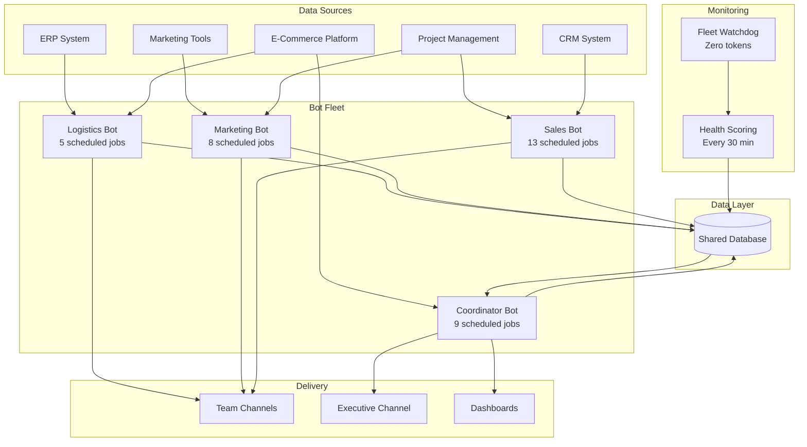

# Case Study: Executive Operations Fleet

**Autonomous AI system replacing manual executive information assembly across 7 operating divisions**

---

## Company Profile

| Attribute | Detail |
|-----------|--------|
| **Industry** | Consumer electronics (publicly traded) |
| **Revenue** | $3-5M annual |
| **Team Size** | 15+ employees |
| **Divisions** | 7 (Customer Support, Sales, Marketing, Design, Product Design, Supply Chain, App Development) |
| **Key Challenge** | Single operations executive managing all divisions with lean team |

---

## The Challenge

The company's COO was the single point of synthesis for all operational data. Every morning started with the same routine:

- **Check Shopify** for yesterday's orders and revenue
- **Check NetSuite** for inventory levels and fulfillment status
- **Check Airtable** for project updates across 40+ bases
- **Check Slack** for overnight messages from manufacturing partners (12-13 hour time zone gap)
- **Check CRM** for pipeline movement and lead status
- **Compile** everything into a mental model of "how are we doing?"

This took 1-2 hours daily. Board reports — which required pulling data from all systems and synthesizing it into a narrative — took 2-3 days each month. When the COO traveled, operational visibility dropped to near zero.

The company needed a system that could do the information assembly autonomously and deliver executive-ready synthesis on a schedule.

---

## The Approach

### Phase 0: Architecture (Week 1)

Mapped all 7 divisions, identified data sources, and designed the bot fleet topology:

- **Hub-and-spoke model:** One coordinator bot orchestrating 3 specialist bots
- **Division assignment:** Each specialist owns 2-3 divisions based on system access patterns
- **Data pipeline:** All bots write to a shared database; coordinator reads and synthesizes

### Phase 1: Foundation (Weeks 2-3)

Deployed the coordinator bot and first specialist (logistics) on cloud infrastructure:

- Set up VPS with systemd services for always-on operation
- Connected to ERP (inventory, orders, financials) and e-commerce platform (sales, fulfillment)
- Established Slack webhook delivery for alerts and briefings
- Validated data accuracy against manual reports

### Phase 2: Integration (Weeks 3-4)

Connected additional enterprise systems and validated cross-system data accuracy:

- **7 system integrations:** ERP, e-commerce, project management, team communication, database, CRM, email marketing
- **Credential architecture:** Shared environment files for common integrations, per-bot credentials for scoped access
- **API validation:** Tested every endpoint against known data to ensure accuracy

### Phase 3: Fleet Expansion (Weeks 4-6)

Added specialist bots and migrated from local development machine to always-on VPS:

- **Marketing specialist:** Campaign performance tracking, content calendar monitoring, marketplace health checks
- **Sales specialist:** Pipeline reporting, lead scoring, sample request tracking, project status aggregation
- **Migration:** Phased move from local scheduled tasks to VPS cron jobs — 4 phases over 2 weeks, zero downtime

### Phase 4: Executive Intelligence (Weeks 6-8)

Built the synthesis layer that transforms raw data into executive-ready outputs:

- **Morning operations pulse:** Daily briefing delivered before 7am with revenue, orders, inventory, and alerts
- **Narrative compiler:** Daily/weekly/monthly executive narratives with highlights, concerns, and action items
- **Fleet health scoring:** Weighted 5-factor score (0-100) calculated every 30 minutes
- **Board metrics compiler:** Monthly automated output with all KPIs pre-calculated
- **Fleet watchdog:** Zero-token shell script monitoring bot health every 15 minutes

---

## Architecture

---

## Results Framework

| Metric | Before | After |
|--------|--------|-------|
| **Executive morning prep** | 1-2 hours daily | 10 minutes (read briefing) |
| **Board report compilation** | 2-3 days monthly | Automated monthly output |
| **Operational visibility when traveling** | Near zero | Full (mobile delivery) |
| **Systems checked manually** | 5-7 daily | 0 (bot fleet handles all) |
| **Scheduled automation jobs** | 0 | 35 across 4 bots |
| **System integrations** | Manual logins | 7 automated connections |
| **Infrastructure cost** | N/A | Sub-$10/month |
| **Fleet health score** | No measurement | 0-100 calculated every 30 min |
| **Alert fatigue** | Constant notifications | "Silent if nothing" — alerts only when action needed |

---

## Lessons Learned

### 1. Operator, Not Assistant

The critical design decision was building an **operator** (runs autonomously on a schedule) rather than an **assistant** (responds to prompts). The executive never opens a chat window. Briefings arrive in Slack before breakfast. This is the difference between "AI that helps when asked" and "AI that runs the operation."

### 2. Silent If Nothing

Early versions sent daily reports even when nothing was notable. This trained the executive to ignore them. The "silent if nothing" principle — agents only communicate when there's something worth communicating — eliminated alert fatigue and made every message meaningful.

### 3. Model Selection by Task

Not every job needs the most capable model. Routing simple data extraction to faster/cheaper models and reserving advanced reasoning for synthesis and narrative tasks reduced token costs by 60-70% without quality degradation. The key insight: match model capability to task complexity.

### 4. Migration Is Change Management

Moving from a local development machine to always-on cloud infrastructure was a 4-phase migration spanning 2 weeks. Each phase was validated independently. The principle: never migrate more than you can roll back in 15 minutes. One bot had a port conflict that caused thousands of restart attempts — caught and fixed because each phase was isolated.

### 5. Token Budget Discipline

Without constraints, AI agents will use unlimited tokens generating verbose outputs nobody reads. Setting explicit token budgets per agent (targeting ~20K tokens total across the fleet per run cycle) forced concise, high-signal outputs. The budget became a design constraint that improved quality.

---

## Technology Stack

| Layer | Technology |
|-------|------------|
| **Infrastructure** | Cloud VPS (Linux), systemd services |
| **Agent Runtime** | Node.js gateway, one service per bot |
| **Scheduling** | Cron-based job scheduling per bot |
| **Data Layer** | PostgreSQL-compatible cloud database |
| **Delivery** | Slack webhooks (3 channels), mobile push |
| **Monitoring** | Shell script watchdog (zero AI tokens), health score database |
| **Integrations** | REST APIs, Admin APIs, MCP protocol |

---

## Applicability

This pattern works for any organization where:

- **One person synthesizes across multiple systems** — the "human router" problem
- **Operational data lives in 5+ systems** that don't natively integrate
- **Board/leadership reporting** is a recurring manual burden
- **Time zone gaps** with manufacturing, distribution, or remote teams create information delays
- **The executive team is lean** and can't hire dedicated analysts for each function

The fleet architecture scales by adding specialist bots — each new division gets its own agent with scoped system access, while the coordinator bot automatically incorporates new data sources into its synthesis.

---

*This case study follows the [JBOT Protocol](../README.md) methodology. For implementation details, see the [Getting Started Guide](../guides/getting-started.md).*
