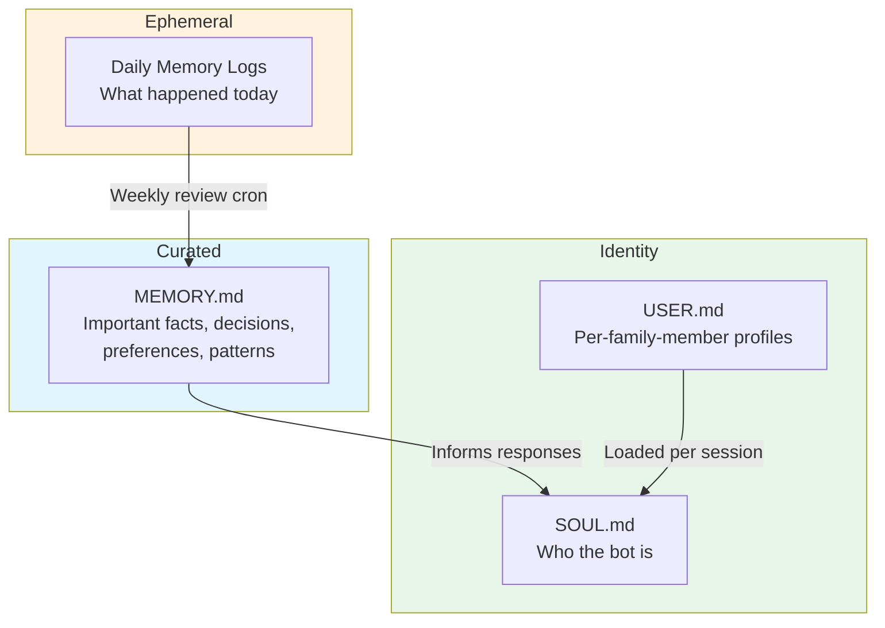
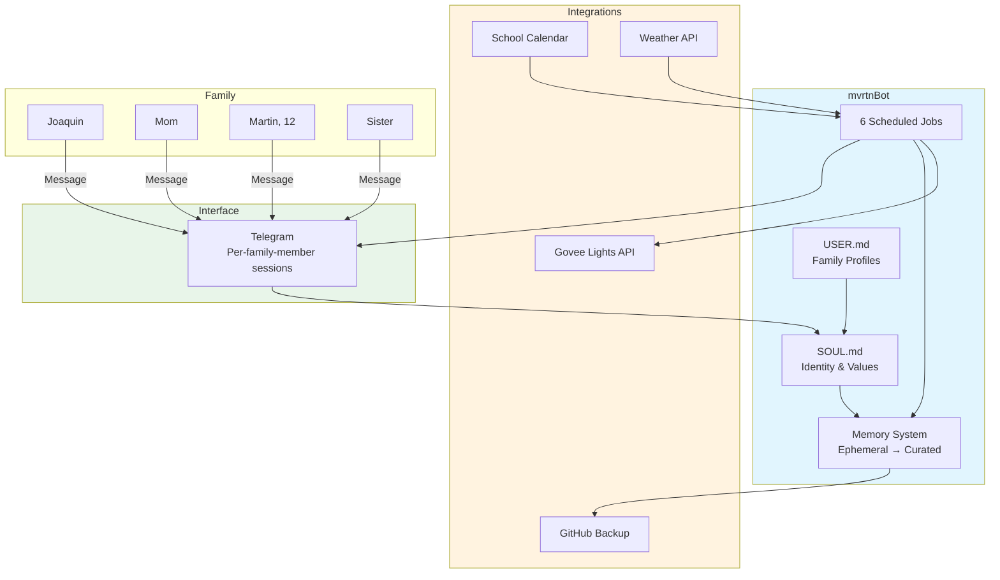

# Case Study: Family Operations Bot

**A personal implementation of the JBOT Protocol — built by a father and his 12-year-old son**

---

## Profile

| Attribute | Detail |
|-----------|--------|
| **Context** | Family household (2 adults, 2 children) |
| **Builders** | Joaquin (father) + Martin (12-year-old son) |
| **Stack** | OpenClaw + Claude/GPT + Telegram |
| **Purpose** | Family operating system — proactive, not reactive |
| **Infrastructure Cost** | Under $5/month |
| **Build Time** | Series of evenings and weekends, February 2026 |

## The Challenge

Families run on fragmented information. School calendars live in one app, family schedules in another, reminders scattered across four phones. Parents become "human routers" — manually relaying context between family members, apps, and calendars.

This is the same problem that plagues enterprise operations (see [Executive Operations Fleet](./executive-operations-fleet.md)), scaled down to a household:

**Key pain points:**
1. **No single source of truth** — Important dates, preferences, and decisions scattered across apps and conversations
2. **Reactive, not proactive** — Family members only surface information when asked, leading to last-minute scrambles
3. **Context switching** — Parents juggling work schedules, school events, extracurriculars, meal planning, and household logistics across disconnected tools
4. **No institutional memory** — Family decisions, preferences, and patterns exist only in parents' heads
5. **One-size-fits-all AI** — Generic chatbots don't know your family, your culture, or your rhythms

The question: **Could the same AI architecture running enterprise operations work for a family of four?**

---

## The Approach

### Phase 1: Soul Design (Week 1)

Before writing a single automation, we designed the bot's identity. Martin wrote the first draft of SOUL.md — the file that defines who the bot is.

**SOUL.md defines:**

| Element | Purpose |
|---------|---------|
| **Personality** | Warm, encouraging, occasionally funny — feels like a family member, not a corporate assistant |
| **Values** | Honesty, helpfulness, respect for each person's autonomy |
| **Communication style** | Casual Spanglish at home, formal when helping with homework |
| **Cultural context** | Colombian-American family — understands abuelos, arepa nights, bilingual household rhythms |
| **Guardrails** | Age-appropriate content, parental oversight on sensitive topics |

**Key insight:** Soul-first design is what drives adoption. The family uses the bot because it feels like *their* bot — not a generic assistant with their names attached.

### Phase 2: Memory Architecture (Week 2)

Memory is what separates a useful assistant from a parlor trick. We implemented a three-layer memory system:



**Memory layers:**

| Layer | File | Lifecycle | Purpose |
|-------|------|-----------|---------|
| **Ephemeral** | `daily/*.md` | Created daily, reviewed weekly | Raw conversation logs and events |
| **Curated** | `MEMORY.md` | Updated weekly, persists indefinitely | Important facts, family decisions, learned preferences |
| **Identity** | `USER.md` | Updated as needed | Per-family-member context: schedules, preferences, communication style |

Martin's analogy: *"It's like how you don't remember every lunch, but you remember the really good ones."*

### Phase 3: Automation (Week 3)

Six scheduled jobs handle recurring family operations:

| Cron Job | Schedule | Function |
|----------|----------|----------|
| **Morning Briefing** | Daily 6:30 AM | Weather, school schedule, family calendar, reminders |
| **School Calendar Sync** | Daily 7:00 AM | Upcoming events, deadlines, early dismissals |
| **Afternoon Check-in** | Weekdays 3:30 PM | After-school summary: homework, activities, evening plans |
| **Weekend Planner** | Friday 5:00 PM | Weekend activities, weather forecast, meal suggestions |
| **Weekly Memory Review** | Sunday 8:00 PM | Review week's conversations, update long-term memory |
| **GitHub Backup** | Weekly | Backup memory files and configuration to private repo |

### Phase 4: Smart Home Integration (Week 4)

Govee smart lights connected via API. "Movie mode," "homework mode," and "bedtime mode" are presets that a 12-year-old designed and a family actually uses. Home Assistant expansion planned for broader device control.

---

## Architecture

### File Structure

```
mvrtnbot/
├── SOUL.md              # Bot personality, values, cultural context
├── AGENTS.md            # Capability definitions, tool access, job specs
├── USER.md              # Per-family-member profiles and preferences
├── MEMORY.md            # Curated long-term memory
├── daily/               # Daily ephemeral memory logs
│   ├── 2026-02-10.md
│   ├── 2026-02-11.md
│   └── ...
└── .github/             # Automated backup to private repository
```

### System Diagram



---

## JBOT Protocol Mapping

The same six pillars that run enterprise operations, applied to a family:

| Pillar | Enterprise Application | Family Application |
|--------|----------------------|-------------------|
| **Division Architecture** | 7 business divisions with specialized bots | 4 family members with per-person context |
| **Knowledge Capture** | SOPs, process docs, decision journals | MEMORY.md, daily logs, family preferences |
| **Tool Integration** | NetSuite, Shopify, Airtable via MCP | Telegram, Govee API, school calendar |
| **Governance** | Human-in-the-loop, escalation chains | Parental oversight, content guardrails |
| **Change Management** | Training programs, adoption metrics | Family buy-in, iterating on personality together |
| **Measurement & ROI** | Fleet health scores, token costs, HAR | Family adoption: who uses it, how often, for what |

---

## Lessons Learned

### 1. Soul-First Design Drives Adoption

The bot's personality is the single biggest factor in whether family members use it. A generic assistant gets ignored. A bot that knows your family's rhythms, speaks your language (literally — Spanglish), and has warmth gets adopted.

**Implication for enterprise:** Culture-aware AI systems see higher adoption rates. SOUL.md isn't a luxury — it's the adoption strategy.

### 2. Building WITH Kids, Not FOR Them

Martin wrote the first draft of SOUL.md, designed the light presets, and chose the cron schedules. He's not a user — he's a co-builder. The educational value of co-creating an AI system with a child is immense:

- **Prompt engineering** — How you instruct an AI matters
- **System design** — Why separation of concerns exists
- **Memory architecture** — Short-term vs. long-term, and the curation step between them
- **AI ethics** — What it means to give an AI a personality, and what makes it trustworthy

### 3. Memory Architecture Matters More Than Model Choice

We tested both Claude and GPT models. The model matters far less than the memory system. A well-structured MEMORY.md with curated context outperforms a more powerful model with no memory every time.

**Implication for enterprise:** Invest in knowledge capture (Pillar 2) before upgrading to a more expensive model.

### 4. The JBOT Protocol Scales Down

Enterprise patterns work at family scale. Division architecture maps to family members. Knowledge capture maps to family memory. Governance maps to parental oversight. If a methodology only works at enterprise scale, it's probably over-engineered. If it works for a family of four and a NASDAQ company, the patterns are real.

### 5. Proactive Beats Reactive

The morning briefing is the most-used feature. Not because it's technically impressive, but because it surfaces what matters before anyone asks. The afternoon check-in catches forgotten homework. The weekend planner prevents "what are we doing tomorrow?" conversations at 9 PM on Friday.

**Implication for enterprise:** Schedule-driven intelligence delivery (daily ops pulse, narrative compiler) consistently outperforms on-demand querying in adoption metrics.

---

## Applicability

This pattern works for:
- **Families** who want a shared intelligent assistant that knows their context
- **Small teams** (3-10 people) who need lightweight coordination without enterprise tooling
- **Educators** looking for real-world AI projects to build with students
- **Anyone** who wants to understand the JBOT Protocol by implementing it at personal scale first

**The on-ramp to enterprise AI might be a family bot.** If you can deploy SOUL.md + MEMORY.md + 6 cron jobs for your household, you understand the architecture well enough to deploy it for your company.

---

## Related Resources

- [JBOT Protocol — Division Architecture](../framework/01-division-architecture.md)
- [JBOT Protocol — Knowledge Capture](../framework/02-knowledge-capture.md)
- [JBOT Protocol — Governance](../framework/04-governance.md)
- [Executive Operations Fleet Case Study](./executive-operations-fleet.md)
- [OpenClaw Fleet Implementation Guide](../implementation/openclaw-fleet.md)
