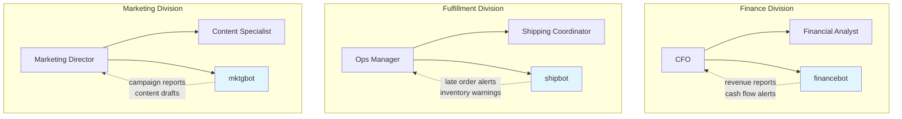
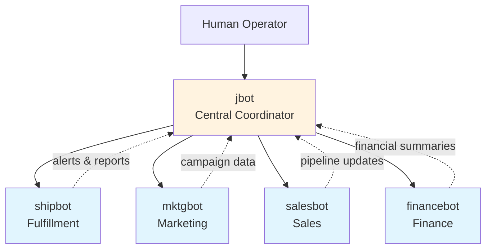
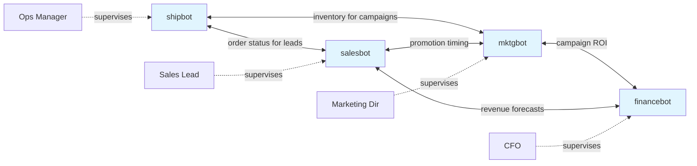
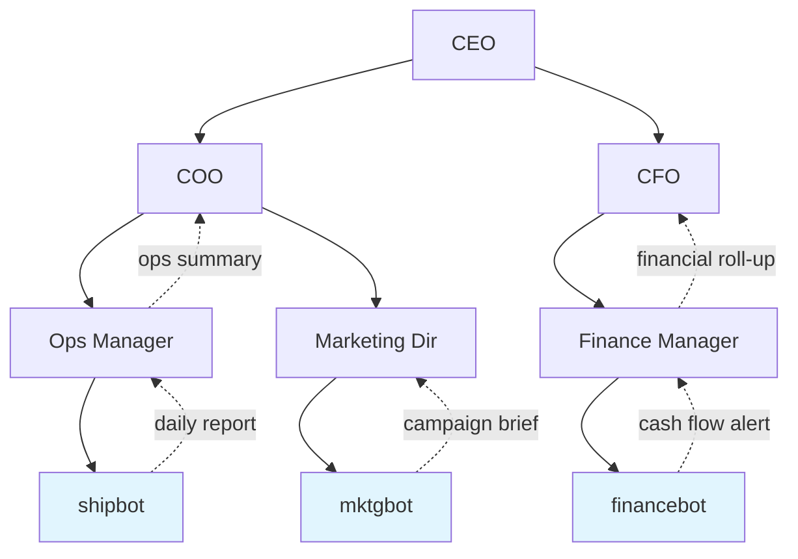

# Pillar 1: Division Architecture

**Flat networks of human-supervised AI teams**

---

## Overview

Division Architecture is the practice of mapping an organization's structure to enable effective AI agent deployment. Rather than hierarchical command chains, JBOT Protocol favor flat networks where AI agents work alongside humans within clearly defined domains.

## Core Principles

### 1.1 Division Mapping

Every organization consists of divisions—functional areas with distinct responsibilities, knowledge domains, and workflows. Before deploying AI agents, you must understand:

- **Division boundaries** — Where does one team's responsibility end and another's begin?
- **Decision authority** — Who approves what? Where are the bottlenecks?
- **Information flows** — How does knowledge move between divisions?
- **Dependencies** — Which divisions rely on outputs from others?

### 1.2 Agent-Team Topology

AI agents should be deployed as members of existing teams, not as separate "AI departments."

#### The Anti-Pattern: Centralized AI Department

Many organizations create a standalone "AI team" that builds tools for other departments. This fails because:

- Agents lack division-specific context and tribal knowledge
- Requests queue up, creating bottlenecks
- The AI team optimizes for technical elegance, not business outcomes

#### The Pattern: Embedded Agents

Each division owns its agents the same way it owns its tools and processes:



#### Comparison: Centralized vs. Embedded

| Dimension | Centralized AI Dept | Embedded Agents |
|-----------|-------------------|-----------------|
| **Context** | Generic, shared across divisions | Deep, division-specific |
| **Ownership** | IT/Engineering owns | Division leader owns |
| **Speed** | Queued requests, slow iteration | Same-day iteration |
| **Knowledge** | Surface-level understanding | Institutional expertise encoded |
| **Scaling** | Linear (more requests = more AI staff) | Parallel (each division scales independently) |
| **Failure mode** | Single point of failure | Isolated blast radius |

**Key considerations:**

- **One division, one (or more) specialized agents**
- **Clear human supervision chains**
- **Defined escalation paths**

### 1.3 The "Pizza Team" Principle

AI teams should follow the same sizing principles as effective human teams:

- Small enough for tight coordination
- Specialized enough for deep expertise
- Connected enough to the broader organization

#### Recommended Team Sizes

| Division Maturity | Human Supervisors | Agent Tasks | Ratio |
|-------------------|-------------------|-------------|-------|
| **Pilot** | 1 | 1-3 | 1:1 to 1:3 |
| **Adoption** | 1-2 | 3-5 | 1:3 to 1:5 |
| **Scaled** | 1-2 | 5-8 | 1:5 to 1:8 |

**Heuristic:** If an agent needs context from more than 2 divisions to complete a task, it's too broad — split it.

#### Case Study: Splitting a Monolithic Bot

An operations team initially deployed a single "ops-bot" that handled fulfillment tracking, marketing reports, sales pipeline updates, and financial summaries.

**Problems observed:**
- Conflicting instructions: marketing tone vs. finance precision
- Context window pollution: irrelevant division data degraded response quality
- Unclear ownership: no single division leader felt responsible

**Resolution:** Split into four specialized agents (shipbot, mktgbot, salesbot, financebot), each owned by a division leader.

**Results:**

| Metric | Before (1 bot) | After (4 agents) |
|--------|----------------|-------------------|
| Response relevance | ~60% | ~90% |
| Time to first useful output | 2 weeks | 2 days per agent |
| Escalation clarity | Unclear routing | Direct to division owner |
| Knowledge depth | Shallow across all | Deep within each |

## Implementation Checklist

- [ ] Complete division inventory
- [ ] Map reporting structures and decision authority
- [ ] Identify high-volume, repetitive workflows per division
- [ ] Define agent roles and human oversight requirements
- [ ] Establish cross-division communication protocols

## Common Patterns

### Pattern A: Hub and Spoke

A central operations agent coordinates with specialized division agents. This maps directly to the [OpenClaw two-server topology](../implementation/openclaw-fleet.md).



**When to use:** Organizations with a clear operations leader who needs cross-division visibility. Best for small-to-mid-size teams (5-50 people) where one person oversees multiple functions.

| Pros | Cons |
|------|------|
| Clear escalation path | Central agent can become bottleneck |
| Single point of synthesis | Hub failure affects all spokes |
| Easy to start with | Doesn't scale past ~8 division agents |

### Pattern B: Mesh Network

Peer-to-peer agent communication with human checkpoints at each node.



**When to use:** Organizations where divisions frequently collaborate and need real-time data sharing. Best for mature teams comfortable with AI and clear inter-division protocols.

| Pros | Cons |
|------|------|
| No single point of failure | Complex to configure and maintain |
| Fast cross-division data flow | Requires strong governance to prevent loops |
| Scales well horizontally | Harder to audit communication paths |

### Pattern C: Hierarchical Hybrid

Traditional reporting structure with AI augmentation at each level. Agents report up through human chains.



**When to use:** Large organizations (100+ people) with established reporting lines, compliance requirements, or regulated industries where audit trails must mirror org structure.

| Pros | Cons |
|------|------|
| Mirrors existing org chart | Slower information flow |
| Clear accountability | Multiple approval layers |
| Audit trail matches structure | Can reinforce silos |

### Migration Path

As organizations mature, they typically progress through patterns:

```
Hub/Spoke → Hierarchical Hybrid → Mesh Network
(startup)    (scaling)             (mature)
```

**Stage 1 — Hub/Spoke:** Start here. One coordinator, simple routing. Validates that agents add value.

**Stage 2 — Hierarchical Hybrid:** As divisions formalize, agents align with reporting structure. Adds accountability.

**Stage 3 — Mesh Network:** Mature organizations with established governance allow direct agent-to-agent communication. Maximizes speed.

## Multi-Bot Role Separation

As a fleet grows beyond a single agent, deliberate role separation becomes critical. Each bot should have a clearly defined function, an appropriate model tier, and scoped access to only the integrations it needs.

### Model-Function Pairing

Not every task requires the most capable model. Match model tier to cognitive complexity:

| Model Tier | Function Type | Use Cases |
|------------|--------------|-----------|
| **Fast / Haiku** | Alerts, monitoring, classification | Inventory threshold alerts, ticket categorization, status checks, health pings |
| **Standard / Sonnet** | Reports, analysis, structured output | Daily summaries, campaign postmortems, data reconciliation, pipeline reports |
| **Advanced / Opus** | Synthesis, strategy, multi-source reasoning | Cross-division narratives, board-level summaries, anomaly investigation, root cause analysis |

**Heuristic:** If the output is a boolean or a number, use Haiku. If it is a structured report, use Sonnet. If it requires judgment across multiple data sources, use Opus.

### API Scope Minimization

Each bot should have access to only the integrations required for its function. This limits blast radius if credentials are compromised and reduces context pollution.

**Principle:** If a bot does not need access to a system, it should not have credentials for that system.

For example, a fulfillment bot needs access to the e-commerce platform and shipping system but has no reason to access the marketing content calendar. A marketing bot needs social media and campaign analytics but should not have access to financial transaction data.

### SOUL.md Identity Pattern

Every bot should have an identity file (conventionally named `SOUL.md`) that defines:

- **Name and role** — A clear one-line description of what this bot does
- **Personality** — Tone, communication style, level of formality
- **Knowledge domain** — What this bot is an expert in; what it should defer on
- **Boundaries** — What this bot must never do, even if asked
- **Escalation rules** — When and how to involve a human or another bot

The SOUL.md file serves as the bot's "constitution" — it is loaded at the start of every session and anchors all behavior. Without it, bots drift in tone, overstep boundaries, and produce inconsistent outputs.

### Spin-Off Threshold

A single bot should not accumulate unlimited responsibilities. When a bot exceeds approximately 20 scheduled tasks, it is time to split it into specialized bots.

**Warning signs that a bot needs splitting:**

- Context window pollution — unrelated data from different functions degrades output quality
- Conflicting instructions — marketing tone guidelines clash with finance precision requirements
- Unclear ownership — multiple division leaders claim or dispute the bot's priorities
- Long execution times — too many cron jobs competing for the same runtime

### Example Bot Roster

| Bot | Model Tier | Scheduled Tasks | Integration Scope |
|-----|-----------|:-:|---|
| **coordinator** | Opus | 5 | Slack, database, all bot outputs (read-only) |
| **shipbot** | Sonnet | 8 | E-commerce platform, shipping system, inventory database |
| **mktgbot** | Sonnet | 7 | Content calendar, social media, campaign analytics |
| **salesbot** | Sonnet | 10 | CRM, project tracker, e-commerce (read-only) |
| **financebot** | Sonnet | 6 | ERP, accounting system, database |
| **alertbot** | Haiku | 12 | Health endpoints, log files, notification channels |

**Note:** The coordinator bot uses the most capable model because it synthesizes outputs from all other bots — a task that requires multi-source reasoning. The alert bot uses the fastest, cheapest model because its tasks are simple threshold checks.

## Deliverables

1. **Division Map** — Visual representation of organizational structure
2. **Agent Placement Plan** — Where agents will be deployed
3. **Supervision Matrix** — Human oversight assignments

---

## Related Templates

- [DIVISION.md](/templates/DIVISION.md) — Template for documenting a business division
