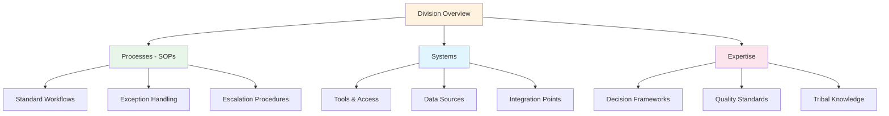
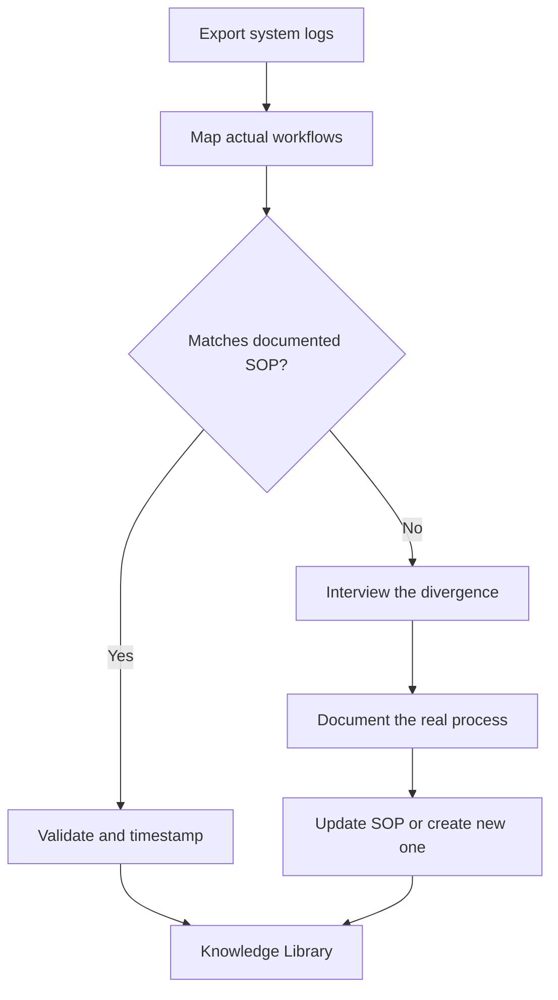

# Pillar 2: Knowledge Capture

**Workforce-as-training-data philosophy**

---

## Overview

Knowledge Capture is the systematic process of documenting institutional expertise, processes, and tribal knowledge in formats that AI agents can understand and apply. Your workforce's collective intelligence becomes the foundation for AI effectiveness.

## Core Principles

### 2.1 The Three Layers of Organizational Knowledge

1. **Explicit Knowledge** — Documented processes, policies, and procedures
2. **Implicit Knowledge** — Skills and habits that people demonstrate but rarely document
3. **Tacit Knowledge** — Intuitions, judgment calls, and "gut feelings" that drive decisions

Most organizations only capture Layer 1. Agentic operations require all three.

### 2.2 Capture Methodology

#### Step 1: Process Documentation
- Map workflows from trigger to completion
- Document decision points and criteria
- Capture exceptions and edge cases

#### Step 2: Expert Interviews

Use the five critical questions from the [discovery interview template](../templates/discovery-interview.md):

| # | Question | What It Captures |
|---|----------|-----------------|
| 1 | "Walk me through your typical day from start to finish." | Workflow sequence, time allocation, hidden dependencies |
| 2 | "What makes someone excellent at this role vs. just adequate?" | Tacit knowledge, quality standards, judgment criteria |
| 3 | "What do you wish new hires understood on day one?" | Tribal knowledge, unwritten rules, context that takes months to absorb |
| 4 | "When something goes wrong, how do you know — and what do you do first?" | Exception handling, diagnostic patterns, escalation instincts |
| 5 | "What information do you check before making a decision?" | Data sources, decision frameworks, the "gut feel" inputs |

**Simplified quick-capture version** (for busy subject matter experts):

> *"I need 15 minutes. Tell me about the last tricky situation you handled — what happened, what you did, and why you chose that approach over alternatives."*

This single prompt often surfaces more actionable knowledge than a full hour of structured questions.

#### Step 3: Decision Archaeology
- Review past decisions and their outcomes
- Document the reasoning behind key choices
- Identify patterns in successful vs. unsuccessful outcomes

### 2.3 The Documentation Hierarchy

## Implementation Checklist

- [ ] Identify knowledge holders per division
- [ ] Schedule capture sessions (interviews, shadowing)
- [ ] Create documentation templates
- [ ] Establish review and validation process
- [ ] Set up knowledge maintenance cadence

## Capture Techniques

### Technique 1: Process Mining

Analyze system logs and workflow data to understand actual vs. documented processes. The goal is to find **shadow processes** — the real workflows people follow that differ from official documentation.

**Tools and methods:**

| Method | Description | Best For |
|--------|-------------|----------|
| **System log analysis** | Export audit trails from ERP, CRM, ticketing systems. Map actual click-paths and time between steps. | High-volume processes with digital trails |
| **Scribe / Tango** | Auto-capture tools that record screen actions as step-by-step guides while experts work naturally. | Documenting without disrupting workflow |
| **Loom recordings** | Ask experts to screen-record themselves doing a task while narrating. Low friction, high context. | Remote teams, async knowledge capture |
| **Shadow process identification** | Compare documented SOPs against system logs. Where do they diverge? The divergence *is* the tribal knowledge. | Finding the gap between "how it should work" and "how it actually works" |

**Process mining workflow:**

### Technique 2: Think-Aloud Protocols

Have experts verbalize their reasoning while performing tasks. This is the most effective method for capturing tacit knowledge — the "gut feelings" that drive expert decisions.

**Interview script:**

**Setup (2 minutes):**
> *"I'm going to watch you do [specific task]. As you work, please narrate your thinking out loud — what you're looking at, what you're deciding, what you're checking. There are no wrong answers. I want to understand how you think about this, not just what buttons you click."*

**During (10-20 minutes):**
Prompt with these questions when the expert goes silent:
- *"What are you looking at right now?"*
- *"What made you choose that option over the other one?"*
- *"Is this how it always goes, or is this unusual?"*
- *"What would you do if [X] were different?"*
- *"How do you know that's right?"*

**After (5 minutes):**
> *"Looking back at what you just did — is there anything you did automatically that a new person wouldn't know to do? Any step where experience changed your approach?"*

### Technique 3: Decision Journaling

Experts log decisions and reasoning in real-time for later analysis. This captures the context that's lost in retrospective interviews.

**Decision Journal Template:**

| Field | Description | Example |
|-------|-------------|---------|
| **Date** | When the decision was made | 2026-02-07 |
| **Decision** | What was decided | Expedited shipment for order #4521 |
| **Context** | What was happening at the time | Customer is a wholesale account, 3rd complaint this quarter |
| **Options Considered** | What alternatives existed | (A) Standard shipping + apology, (B) Expedite + discount, (C) Expedite only |
| **Reasoning** | Why this option was chosen | Wholesale retention > shipping cost. Similar situation last month, standard response lost the account. |
| **Outcome** | What happened as a result | Customer retained, placed $12K reorder next week |
| **Retrospective** | Would you decide the same way again? | Yes — created a rule: wholesale accounts with 2+ complaints get auto-expedite |

**Implementation tip:** Start with a shared spreadsheet or Airtable base. Ask 2-3 key experts to log just 1 decision per day for 2 weeks. The patterns that emerge are more valuable than months of formal process documentation.

## Quality Standards

Good knowledge documentation should be:

- **Specific** — Concrete enough for an AI to follow
- **Complete** — Covers standard cases and edge cases
- **Current** — Reflects how work is actually done today
- **Accessible** — Written in clear, jargon-free language

## Deliverables

1. **Knowledge Inventory** — Catalog of captured expertise by division
2. **Process Library** — Complete SOP documentation
3. **System Documentation** — Technical specs for all integrated tools
4. **Custom Instructions** — AI-ready synthesis of knowledge

---

## Related Templates

- [PROCESSES.md](/templates/PROCESSES.md) — SOP documentation template
- [SYSTEMS.md](/templates/SYSTEMS.md) — Software documentation template
- [CUSTOM-INSTRUCTIONS.md](/templates/CUSTOM-INSTRUCTIONS.md) — Claude Project instructions
