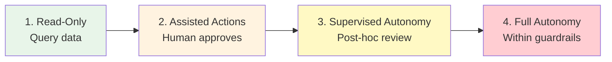
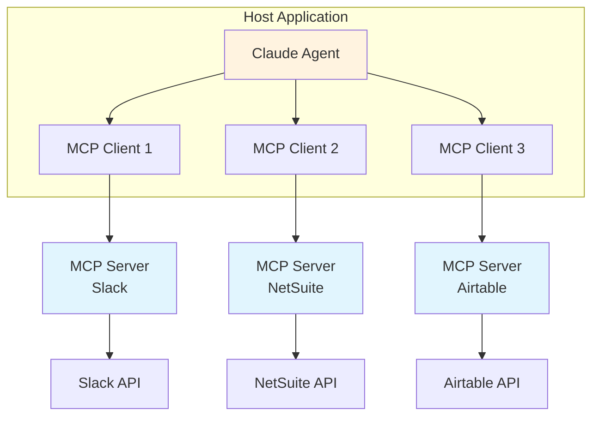

# Pillar 3: Tool Integration

**AI mesh connecting enterprise systems**

---

## Overview

Tool Integration is the technical backbone of JBOT Protocol—connecting AI agents to the business systems where work actually happens. This pillar covers APIs, Model Context Protocol (MCP) servers, webhooks, and the architecture needed for agents to take action.

## Core Principles

### 3.1 The Integration Spectrum

From least to most capable — start left, move right as trust is established:



1. **Read-Only Access** — Agent can query data but not modify
2. **Assisted Actions** — Agent prepares actions for human approval
3. **Supervised Autonomy** — Agent acts with post-hoc review
4. **Full Autonomy** — Agent acts independently within guardrails

### 3.2 MCP (Model Context Protocol)

Anthropic's Model Context Protocol provides a standardized way to connect Claude to external tools and data sources. MCP is to AI agents what USB was to peripherals — a universal connector.

#### Client-Server Architecture



**Key MCP Concepts:**
- **Servers** — Services that expose tools and resources to Claude. Each server wraps one or more external systems.
- **Tools** — Functions the agent can invoke (e.g., `create_ticket`, `send_email`, `run_sql_query`). Tools have typed parameters and return structured results.
- **Resources** — Data sources the agent can read (e.g., database records, document contents, API responses). Resources are read-only by default.
- **Prompts** — Reusable prompt templates that servers can expose for common workflows.

#### Current MCP Ecosystem

| Server | Category | Provider | Capabilities |
|--------|----------|----------|-------------|
| **Slack** | Communication | Official (Anthropic) | Read/send messages, channels, users |
| **GitHub** | Development | Official | Repos, issues, PRs, code search |
| **Google Drive** | Documents | Official | Read/search files, folders |
| **Airtable** | Project Management | Official | Records, bases, tables, fields |
| **Supabase** | Database | Official | SQL queries, table management, edge functions |
| **Figma** | Design | Official | Design tokens, components, screenshots |
| **HubSpot** | CRM | Official | Contacts, deals, companies, pipelines |
| **NetSuite** | ERP | Custom / Zapier | Records, saved searches, SuiteQL |
| **Shopify** | E-commerce | Zapier | Orders, products, customers, inventory |
| **Intercom** | Support | Community | Conversations, contacts, articles |
| **Notion** | Knowledge Base | Community | Pages, databases, blocks |
| **Linear** | Project Management | Community | Issues, projects, cycles |

#### Configuration Example

MCP servers are configured in JSON (Claude Code) or through the Claude desktop app:

```json
{
  "mcpServers": {
    "slack": {
      "command": "npx",
      "args": ["-y", "@anthropic/mcp-server-slack"],
      "env": {
        "SLACK_BOT_TOKEN": "xoxb-..."
      }
    },
    "airtable": {
      "command": "npx",
      "args": ["-y", "@anthropic/mcp-server-airtable"],
      "env": {
        "AIRTABLE_API_KEY": "pat..."
      }
    }
  }
}
```

#### Governance Default: Start Read-Only

Every new MCP integration should begin at Level 1 (Read-Only) on the Integration Spectrum. Promote to higher levels only after establishing trust through successful read operations.

### 3.3 Integration Architecture

The MCP Client-Server diagram above (Section 3.2) illustrates the integration architecture. Each MCP server wraps a business system API and exposes typed tools and resources to the Claude agent.

## Implementation Checklist

- [ ] Inventory all systems requiring integration
- [ ] Assess API availability and documentation
- [ ] Define permission levels per system
- [ ] Build or configure MCP servers
- [ ] Implement authentication and security
- [ ] Test integrations in sandbox environment
- [ ] Document all integration points

## Common Integrations

### Category: Communication

| System | MCP Available | Complexity | Default Level | Notes |
|--------|:------------:|:----------:|:-------------:|-------|
| Gmail | Yes (Google) | Low | Read-Only | Start with reading/searching; promote to draft creation with approval |
| Outlook / M365 | Community | Medium | Read-Only | Microsoft Graph API; auth can be complex |
| Slack | Yes (Official) | Low | Read-Only | Read channels first; promote to posting with human review |
| Microsoft Teams | Community | Medium | Read-Only | Similar to Slack pattern; fewer MCP options |
| Google Calendar | Yes (Google) | Low | Assisted | Read events; create with approval |

**Governance default:** All external-facing communication (email sends, Slack messages to customers) starts at **Assisted Actions** (Level 2) with human approval. Internal notifications can start at **Supervised Autonomy** (Level 3).

### Category: Data & Documents

| System | MCP Available | Complexity | Default Level | Notes |
|--------|:------------:|:----------:|:-------------:|-------|
| Google Drive | Yes (Official) | Low | Read-Only | Search, read, summarize documents |
| SharePoint | Community | Medium | Read-Only | Via Microsoft Graph; permission model is complex |
| PostgreSQL / MySQL | Yes (Supabase) | Low | Read-Only | Use parameterized queries; never expose raw SQL to agents |
| MongoDB | Community | Medium | Read-Only | Document retrieval; schema-aware querying |
| Notion | Community | Low | Read-Only | Pages, databases, blocks; good for knowledge bases |
| Confluence | Community | Medium | Read-Only | Spaces, pages, search; Atlassian auth required |

**Governance default:** All database integrations start **Read-Only** (Level 1). Write access requires explicit governance review and should use dedicated service accounts with row-level security.

### Category: Business Systems

| System | MCP Available | Complexity | Default Level | Notes |
|--------|:------------:|:----------:|:-------------:|-------|
| HubSpot | Yes (Official) | Low | Read-Only | Full CRM: contacts, deals, companies, pipelines |
| Salesforce | Community | High | Read-Only | Complex permission model; use connected apps |
| NetSuite | Custom / Zapier | High | Read-Only | SuiteQL for queries; custom MCP server recommended |
| Shopify | Zapier | Medium | Read-Only | Orders, products, inventory, customers |
| Airtable | Yes (Official) | Low | Read-Only | Flexible; good bridge between structured and unstructured data |
| Jira / Linear | Community | Medium | Read-Only | Issues, projects, sprints; promote to create with approval |
| Zendesk / Intercom | Limited | Medium | Read-Only | Ticket reading and categorization; respond via drafts |

**Governance default:** CRM and ERP systems start **Read-Only** (Level 1). Record creation promoted to **Assisted Actions** (Level 2) after 2 weeks of successful read operations. Financial transactions remain at Level 2 permanently.

### Category: Custom Applications

| System | MCP Available | Complexity | Default Level | Notes |
|--------|:------------:|:----------:|:-------------:|-------|
| REST APIs | Build custom | Medium | Read-Only | Wrap in MCP server; define typed tools per endpoint |
| GraphQL APIs | Build custom | Medium | Read-Only | Schema-aware querying; map to MCP tools |
| Legacy systems | Via middleware | High | Read-Only | Use API gateway or webhook bridge; avoid direct DB access |
| Internal databases | Build custom | Medium | Read-Only | Custom MCP server with parameterized queries |
| Webhooks (inbound) | N/A | Low | Exception-Only | Trigger agent workflows from external events |

**Governance default:** Custom integrations require a security review before deployment. All custom MCP servers should implement rate limiting, input validation, and audit logging.

**Building a custom MCP server:** When no official server exists, build one using the [MCP SDK](https://github.com/anthropics/model-context-protocol). The server should expose only the specific operations the agent needs — never a generic "execute any API call" tool.

## Integration Failure Modes

Managed MCP servers and third-party APIs fail in predictable ways. Understanding these patterns prevents wasted development time and informs fallback strategies.

### Common MCP Failure Patterns

| Failure Mode | Symptom | Root Cause | Mitigation |
|-------------|---------|------------|------------|
| **GET-only limitation** | Write operations return permission errors or silently fail | Managed MCP providers (e.g., Zapier) expose read access but restrict or block write operations | Build a custom MCP server for write operations; use managed MCP for reads |
| **Timeout on large result sets** | Agent receives partial data or a timeout error | Query returns too many records; MCP server has a response size limit | Add filters to narrow result sets; paginate queries; pre-aggregate in the source system |
| **Auth token expiry** | Operations fail after working for days or weeks | OAuth tokens expire (commonly 60-90 days); refresh token not implemented | Track token expiry dates; implement automated refresh; set calendar reminders for manual rotation |
| **Rate limiting** | Intermittent 429 errors during high-activity periods | Too many API calls in a short window; multiple bots hitting the same endpoint | Stagger cron schedules across bots; implement exponential backoff; cache frequently-read data |
| **Schema drift** | Agent sends valid-looking requests that the API rejects | Source system updated its API schema; MCP server not updated to match | Pin MCP server versions; monitor for API changelog updates; test integrations after source system upgrades |

### Custom MCP Fallback Pattern

When a managed MCP cannot perform the operations your agents need, build a lightweight custom MCP server that wraps the specific API endpoints required. This is not a full integration platform — it is a thin, purpose-built wrapper.

**Build a custom MCP when:**
- The managed MCP is read-only but your agents need to create or update records
- The managed MCP does not expose the specific endpoints you need
- You need fine-grained control over request formatting, error handling, or retries

**Keep the managed MCP when:**
- Read operations work correctly and reliably
- The managed provider handles auth refresh and schema updates for you
- The read surface area is larger than what you would want to maintain yourself

### Integration Spectrum in Practice

A common progression pattern emerges for each system integration:

```
Managed MCP (reads) → Custom MCP (writes) → Direct API (curl templates in skills)
```

**Stage 1 — Managed MCP for reads.** Start with a managed MCP provider. Read data, validate accuracy, build agent workflows around the outputs. Zero custom code required.

**Stage 2 — Custom MCP for writes.** When agents need to create or update records and the managed MCP cannot do it, build a minimal custom MCP server. Keep the managed MCP for reads; use the custom server only for the write operations that are blocked.

**Stage 3 — Direct API via skill templates.** For simple, well-understood operations (e.g., a single POST to a known endpoint), skip the MCP overhead entirely. Embed the curl command directly in the agent's skill file with parameterized templates. This eliminates a dependency and gives the agent direct, auditable control.

**Not every integration reaches Stage 3.** Many systems work perfectly well at Stage 1 or Stage 2 indefinitely. Only move right when a concrete limitation forces you to.

## Credential Architecture

How credentials are stored and scoped across a multi-bot fleet is a security and operational decision that scales with fleet size.

### Shared vs. Per-Bot Credentials

| Model | When to Use | Example |
|-------|------------|---------|
| **Shared credentials** | Multiple bots legitimately need the same service; the API does not support multiple tokens | E-commerce Admin API token used by fulfillment bot (order status), coordinator bot (daily summary), and sales bot (revenue queries) |
| **Per-bot credentials** | Only specific bots need access; the service supports multiple API keys | Project tracker PAT granted only to the marketing and sales bots; fulfillment bot has no access |
| **Environment-scoped** | Credentials differ between development and production | Sandbox API keys for testing; production keys on the fleet server only |

### Credential Inventory

| Credential Type | Scope | Rotation Frequency | Storage Pattern |
|----------------|-------|-------------------|-----------------|
| API admin tokens | Shared across authorized bots | 90 days or on personnel change | Central env file on fleet server, readable by all bot services |
| Personal access tokens | Per-bot or per-integration | 90 days | Bot-specific env file in bot home directory |
| OAuth tokens | Per-integration | Auto-refresh (monitor expiry) | Central env file with refresh token; alert on refresh failure |
| Webhook URLs | Per-channel or per-service | Rotate only if compromised | Central env file; treat as secrets (not in source control) |
| Database connection strings | Shared across all bots | On password rotation | Central env file; use connection pooling |

### Governing Principle

**If a bot does not need it, it should not have it.** Every unnecessary credential in a bot's environment is an expanded blast radius. When adding a new integration, ask: "Which specific bots require this access, and why?" Grant access only to those bots.

## Security Considerations

### Authentication

- Use service accounts with minimal required permissions
- Implement API key rotation
- Audit access logs regularly

### Data Protection

- Encrypt data in transit and at rest
- Define data retention policies
- Implement PII handling procedures

### Access Control

- Principle of least privilege
- Role-based access control (RBAC)
- Regular permission audits

## Deliverables

1. **Integration Inventory** — All systems and their integration status
2. **MCP Server Specifications** — Technical documentation for each server
3. **Security Matrix** — Permissions and access controls
4. **Runbooks** — Troubleshooting and maintenance procedures

---

## Related Templates

- [SYSTEMS.md](/templates/SYSTEMS.md) — Software documentation template
