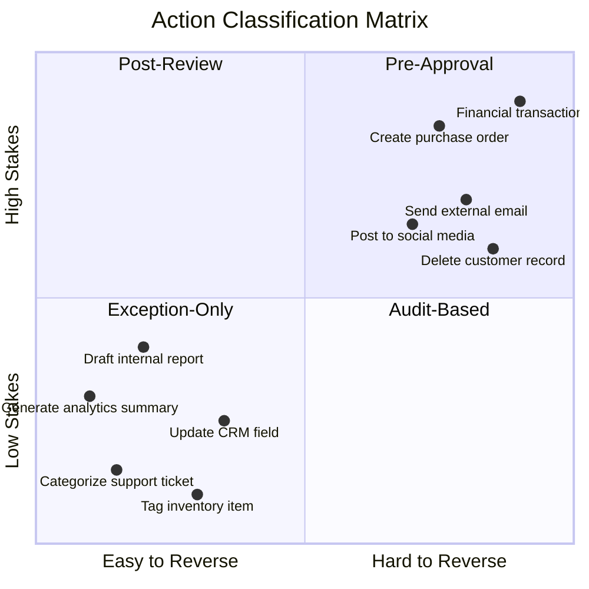
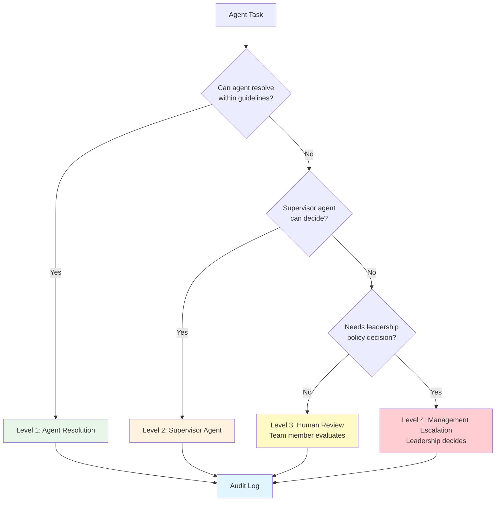

# Pillar 4: Governance

**Agents control agents**

---

## Overview

Governance establishes the rules, guardrails, and oversight mechanisms that ensure AI agents operate safely and effectively. The key insight: the best governance scales through layered AI supervision, not human bottlenecks.

## Core Principles

### 4.1 The Governance Stack

```
┌────────────────────────────────────────┐
│      Human Strategic Oversight         │  ← Policy, exceptions, escalations
├────────────────────────────────────────┤
│        Supervisor Agents               │  ← Quality control, compliance
├────────────────────────────────────────┤
│         Worker Agents                  │  ← Task execution
├────────────────────────────────────────┤
│      Guardrails & Constraints          │  ← Hard limits, permissions
└────────────────────────────────────────┘
```

### 4.2 Human-in-the-Loop Patterns

#### Decision Matrix: Stakes x Reversibility

Use this 2x2 matrix to determine the appropriate human oversight pattern for any agent action:



| Quadrant | Pattern | When | Examples |
|----------|---------|------|----------|
| **High Stakes + Hard to Reverse** | Pre-Approval | Always require human sign-off before action | Financial transactions, external communications to customers, purchase orders, contract modifications |
| **High Stakes + Easy to Reverse** | Post-Review | Agent acts, human reviews within defined window | Social media drafts (can delete), internal reports (can retract), CRM updates to key accounts |
| **Low Stakes + Hard to Reverse** | Audit-Based | Agent acts autonomously, periodic spot-checks | Deleting duplicate records, archiving old tickets, bulk data cleanup |
| **Low Stakes + Easy to Reverse** | Exception-Only | Agent fully autonomous, human reviews only flagged exceptions | Ticket categorization, data extraction, status updates, routine notifications |

**Pattern A: Pre-Approval**
Human approves before agent acts. Use for high-stakes, irreversible actions.

**Pattern B: Post-Review**
Agent acts, human reviews. Use for medium-stakes, reversible actions.

**Pattern C: Exception-Only**
Agent acts autonomously, human reviews exceptions. Use for low-stakes, high-volume actions.

**Pattern D: Audit-Based**
Agent acts autonomously, periodic audits. Use for routine, well-understood processes.

### 4.3 Agent-to-Agent Oversight

Scale quality control by having specialized agents review other agents' work:

- **Compliance Agent** — Reviews outputs for policy adherence
- **Quality Agent** — Checks work against standards
- **Audit Agent** — Monitors for anomalies and patterns

## Implementation Checklist

- [ ] Define action categories and risk levels
- [ ] Map human-in-the-loop requirements per category
- [ ] Establish escalation procedures
- [ ] Configure supervisor agents
- [ ] Implement audit logging
- [ ] Create incident response procedures
- [ ] Set up regular governance reviews

## Guardrail Types

### Hard Guardrails

Non-negotiable constraints built into the system:

- **Permission boundaries** — What the agent literally cannot access
- **Action limits** — Maximum spend, volume, or scope
- **Prohibited actions** — Things the agent must never do

### Soft Guardrails

Guidelines enforced through instruction and review:

- **Tone and voice** — Communication standards
- **Quality thresholds** — Acceptable output criteria
- **Escalation triggers** — When to involve humans

## Escalation Framework



### Level 1: Agent Resolution
Agent handles independently within guidelines.

### Level 2: Supervisor Agent
Secondary agent reviews and decides.

### Level 3: Human Review
Human team member evaluates and approves.

### Level 4: Management Escalation
Leadership involvement for policy decisions.

## Audit & Compliance

### Logging Requirements

- All agent actions with timestamps
- Decision reasoning (when available)
- Human interventions and overrides
- System errors and exceptions

### Review Cadence

- **Daily** — Exception reports
- **Weekly** — Quality metrics
- **Monthly** — Governance effectiveness
- **Quarterly** — Policy review

## Deliverables

1. **Governance Policy** — Rules and guidelines for agent behavior
2. **Risk Matrix** — Actions categorized by risk level
3. **Escalation Procedures** — Clear paths for human involvement
4. **Audit Framework** — Logging and review requirements

---

## Related Templates

- [CUSTOM-INSTRUCTIONS.md](/templates/CUSTOM-INSTRUCTIONS.md) — Embedding governance in agent instructions
