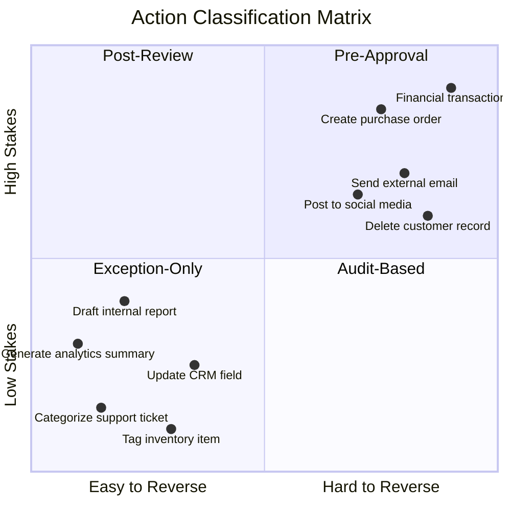
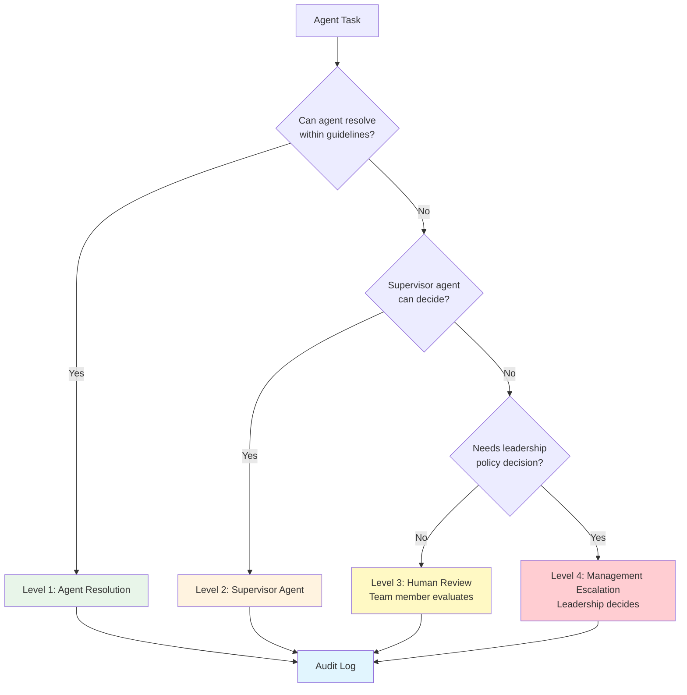
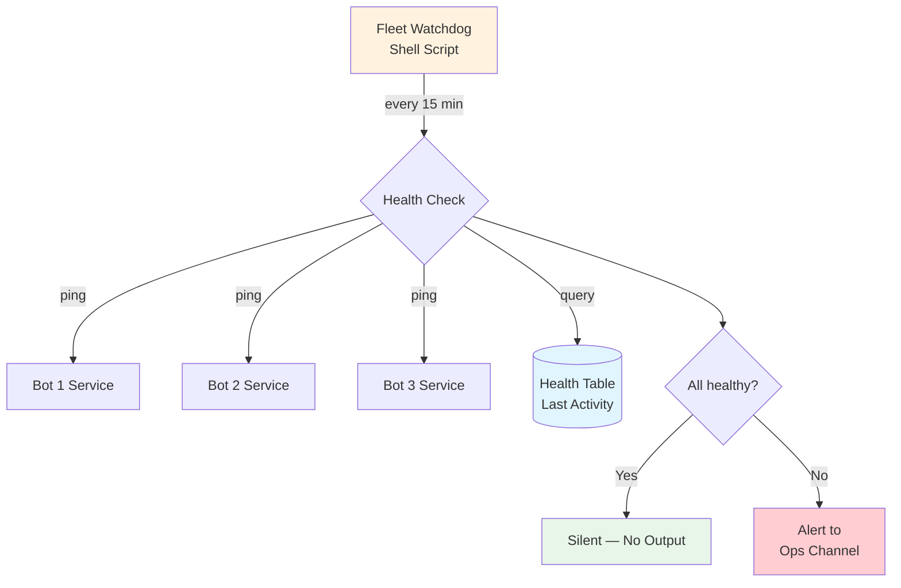

# Pillar 4: Governance

**Agents control agents**

---

## Overview

Governance establishes the rules, guardrails, and oversight mechanisms that ensure AI agents operate safely and effectively. The key insight: the best governance scales through layered AI supervision, not human bottlenecks.

## Core Principles

### 4.1 The Governance Stack

```
┌────────────────────────────────────────┐
│      Human Strategic Oversight         │  ← Policy, exceptions, escalations
├────────────────────────────────────────┤
│        Supervisor Agents               │  ← Quality control, compliance
├────────────────────────────────────────┤
│         Worker Agents                  │  ← Task execution
├────────────────────────────────────────┤
│      Guardrails & Constraints          │  ← Hard limits, permissions
└────────────────────────────────────────┘
```

### 4.2 Human-in-the-Loop Patterns

#### Decision Matrix: Stakes x Reversibility

Use this 2x2 matrix to determine the appropriate human oversight pattern for any agent action:


```mermaid
quadrantChart
    title Action Classification Matrix
    x-axis Easy to Reverse --> Hard to Reverse
    y-axis Low Stakes --> High Stakes
    quadrant-1 Pre-Approval
    quadrant-2 Post-Review
    quadrant-3 Exception-Only
    quadrant-4 Audit-Based
    Send external email: [0.8, 0.7]
    Financial transaction: [0.9, 0.9]
    Delete customer record: [0.85, 0.6]
    Draft internal report: [0.2, 0.4]
    Categorize support ticket: [0.15, 0.15]
    Update CRM field: [0.35, 0.25]
    Post to social media: [0.7, 0.65]
    Generate analytics summary: [0.1, 0.3]
    Create purchase order: [0.75, 0.85]
    Tag inventory item: [0.3, 0.1]
```

| Quadrant | Pattern | When | Examples |
|----------|---------|------|----------|
| **High Stakes + Hard to Reverse** | Pre-Approval | Always require human sign-off before action | Financial transactions, external communications to customers, purchase orders, contract modifications |
| **High Stakes + Easy to Reverse** | Post-Review | Agent acts, human reviews within defined window | Social media drafts (can delete), internal reports (can retract), CRM updates to key accounts |
| **Low Stakes + Hard to Reverse** | Audit-Based | Agent acts autonomously, periodic spot-checks | Deleting duplicate records, archiving old tickets, bulk data cleanup |
| **Low Stakes + Easy to Reverse** | Exception-Only | Agent fully autonomous, human reviews only flagged exceptions | Ticket categorization, data extraction, status updates, routine notifications |

**Pattern A: Pre-Approval**
Human approves before agent acts. Use for high-stakes, irreversible actions.

**Pattern B: Post-Review**
Agent acts, human reviews. Use for medium-stakes, reversible actions.

**Pattern C: Exception-Only**
Agent acts autonomously, human reviews exceptions. Use for low-stakes, high-volume actions.

**Pattern D: Audit-Based**
Agent acts autonomously, periodic audits. Use for routine, well-understood processes.

### 4.3 Agent-to-Agent Oversight

Scale quality control by having specialized agents review other agents' work:

- **Compliance Agent** — Reviews outputs for policy adherence
- **Quality Agent** — Checks work against standards
- **Audit Agent** — Monitors for anomalies and patterns

## Implementation Checklist

- [ ] Define action categories and risk levels
- [ ] Map human-in-the-loop requirements per category
- [ ] Establish escalation procedures
- [ ] Configure supervisor agents
- [ ] Implement audit logging
- [ ] Create incident response procedures
- [ ] Set up regular governance reviews

## Guardrail Types

### Hard Guardrails

Non-negotiable constraints built into the system:

- **Permission boundaries** — What the agent literally cannot access
- **Action limits** — Maximum spend, volume, or scope
- **Prohibited actions** — Things the agent must never do

### Soft Guardrails

Guidelines enforced through instruction and review:

- **Tone and voice** — Communication standards
- **Quality thresholds** — Acceptable output criteria
- **Escalation triggers** — When to involve humans

## Escalation Framework


```mermaid
graph TD
    T[Agent Task] --> D{Can agent resolve<br/>within guidelines?}
    D -->|Yes| L1[Level 1: Agent Resolution]
    D -->|No| S{Supervisor agent<br/>can decide?}
    S -->|Yes| L2[Level 2: Supervisor Agent]
    S -->|No| H{Needs leadership<br/>policy decision?}
    H -->|No| L3[Level 3: Human Review<br/>Team member evaluates]
    H -->|Yes| L4[Level 4: Management Escalation<br/>Leadership decides]

    L1 --> LOG[Audit Log]
    L2 --> LOG
    L3 --> LOG
    L4 --> LOG

    style L1 fill:#e8f5e9
    style L2 fill:#fff3e0
    style L3 fill:#fff9c4
    style L4 fill:#ffcdd2
    style LOG fill:#e1f5fe
```

### Level 1: Agent Resolution
Agent handles independently within guidelines.

### Level 2: Supervisor Agent
Secondary agent reviews and decides.

### Level 3: Human Review
Human team member evaluates and approves.

### Level 4: Management Escalation
Leadership involvement for policy decisions.

## Audit & Compliance

### Logging Requirements

- All agent actions with timestamps
- Decision reasoning (when available)
- Human interventions and overrides
- System errors and exceptions

### Review Cadence

- **Daily** — Exception reports
- **Weekly** — Quality metrics
- **Monthly** — Governance effectiveness
- **Quarterly** — Policy review

## Fleet Watchdog Pattern

At scale, monitoring the monitors becomes its own challenge. The Fleet Watchdog pattern addresses this with a lightweight, zero-token health check that runs independently of the AI fleet.

### Zero-Token Cross-Platform Monitoring

The watchdog is not an LLM agent. It is a simple shell script or lightweight process that:

- Pings each bot's health endpoint on a fixed schedule (e.g., every 15 minutes)
- Checks a shared database table for recent activity from each bot
- Sends an alert only when something is wrong

Because it uses no AI tokens, the watchdog has zero marginal cost and can run indefinitely without budget concerns. It is the one component that should never be an AI agent — it must be simpler and more reliable than the systems it monitors.


```mermaid
graph TD
    W[Fleet Watchdog<br/>Shell Script] -->|every 15 min| H{Health Check}
    H -->|ping| B1[Bot 1 Service]
    H -->|ping| B2[Bot 2 Service]
    H -->|ping| B3[Bot 3 Service]
    H -->|query| DB[(Health Table<br/>Last Activity)]

    H --> D{All healthy?}
    D -->|Yes| S[Silent — No Output]
    D -->|No| A[Alert to<br/>Ops Channel]

    style W fill:#fff3e0
    style S fill:#e8f5e9
    style A fill:#ffcdd2
    style DB fill:#e1f5fe
```

### Data Freshness Pre-Check

Before generating any report, an agent should verify that its source data is recent enough to be useful. A daily sales report built on 3-day-old data is worse than no report — it creates false confidence.

**Implementation:** Each data pipeline writes a timestamp to a shared table when it completes successfully. Before executing a report, the agent queries this table and compares the timestamp against a staleness threshold. If the data is too old, the agent either skips the report and logs the reason, or generates the report with a prominent staleness warning.

### Retention Policies

Not all data needs to live forever. Define retention tiers to keep storage costs manageable and query performance fast:

| Tier | Retention Period | Storage | Contents |
|------|:---:|---|---|
| **Hot** | 7 days | Primary database (active tables) | Real-time metrics, recent bot outputs, active alerts |
| **Warm** | 30 days | Archived tables or separate schema | Aggregated daily summaries, resolved alerts, completed task logs |
| **Cold** | 90+ days | Exported to flat files or deleted | Monthly rollups, historical baselines, audit records |

**Cleanup cadence:** Run a retention job weekly that moves hot data past 7 days to warm, and warm data past 30 days to cold. Automate this — manual cleanup does not happen.

### "Silent If Nothing" Output Principle

The fastest way to create alert fatigue is to send a notification every time an agent runs, even when there is nothing to report. The "Silent If Nothing" principle states:

**An agent should produce output only when there is something actionable to communicate.**

- A late-order alert with zero late orders should generate no message
- An inventory watchdog with all SKUs above threshold should log internally but not notify anyone
- A health check where all systems are green should remain silent

This principle preserves the signal-to-noise ratio of notification channels. When a message does appear, the team knows it requires attention.

## Kill Hierarchy

Kill procedures are trust infrastructure. A team that has never rehearsed stopping its fleet will hesitate when something goes wrong — and hesitation during an incident is how a bad hour becomes a bad week. Define three levels before you need any of them:

| Level | Scope | Procedure | When |
|-------|-------|-----------|------|
| **Level 1 — Isolate a bot** | One agent | Stop its service, revoke its credentials, preserve its logs and workspace untouched | One bot misbehaving: runaway loop, bad outputs, suspected compromise of one credential |
| **Level 2 — Freeze the fleet** | All scheduled execution | Disable all cron schedules fleet-wide without tearing down infrastructure; interactive use may continue | Shared dependency gone bad (poisoned data source, broken integration) where every scheduled run would compound the damage |
| **Level 3 — Full stop (nuclear)** | Everything | Stop all services, rotate all credentials, snapshot all state for post-mortem before touching anything | Confirmed compromise, or you cannot establish what's wrong and the cost of running exceeds the cost of stopping |

**Rules that make the hierarchy work:**

- **Each level has a named owner and a written one-page procedure.** During an incident nobody should be reading API docs to figure out how to revoke a token.
- **Preserve before you fix.** At every level, logs and state are evidence. The post-mortem is worth more than the five minutes saved by wiping and restarting.
- **Rehearse Level 1 quarterly.** Pick a bot, kill it, time the procedure, bring it back. The rehearsal also validates that your restore path works — an untested restore is a second incident waiting inside the first.
- **Authority is pre-delegated.** Whoever is on watch can execute Level 1 without approval. Level 2 needs one operator decision. Level 3 needs the system owner — but the *procedure* must be executable by anyone, because the owner may be asleep.

## Decommissioning & Succession

The kill hierarchy handles emergencies. Decommissioning is the *planned* version — retiring an agent deliberately — and it fails in quieter, more expensive ways. The failure mode isn't the retired bot; it's everything that silently depended on it.

A production lesson from our own fleet: when we retired our executive hub bot, its scheduled jobs were reassigned and its service masked — the visible work moved cleanly. What we missed was discovered only in an audit weeks later: two reporting layers had died with it, because the hub was their only *consumer*. The bots feeding those layers kept writing signals nobody read. Nothing alerted, because producing a signal isn't an error — it's just waste, invisibly accumulating.

**Two rules fall out of this:**

1. **Every signal needs a named consumer that survives the producer's retirement.** Before retiring an agent, enumerate not just what it *does* but what it *reads*. Anything only-it-reads either gets a new consumer or gets explicitly shut off at the source. A signal without a consumer should fail loudly, not accumulate silently.
2. **Every layer needs a survivor plan.** If a capability (a narrative report, a health score, an escalation path) exists only because one agent maintains it, that capability dies with the agent. Decide deliberately: reassign it, productize it into shared infrastructure, or kill it on purpose — never by accident.

**Decommissioning checklist:**

- [ ] Inventory the agent's outputs: who consumes each one? Reassign or sunset each explicitly.
- [ ] Inventory the agent's *inputs*: which signals does only this agent consume? Stop them at the source or reassign the consumer.
- [ ] Reassign or retire its scheduled jobs — verify each landed by watching one full cycle on the new owner.
- [ ] Mask (don't delete) its service and archive its workspace — you will want its memory and logs for at least one quarter.
- [ ] Revoke its credentials. A retired bot with live credentials is an unmonitored attack surface.
- [ ] Run the audit 2–4 weeks later: grep for orphaned signals, dead dashboard sections, and references to the retired agent in other bots' instructions.
- [ ] Update the protocol docs and fleet diagrams. Stale architecture docs cost the next operator real hours.

Retirement is a normal lifecycle event — fleets that can't retire agents calcify around their earliest design decisions. Our hub-and-spoke topology was right for a 4-bot fleet and wrong for a 10-bot one; retiring the hub was correct. The lesson is to retire *completely*.

## Cost Discipline Is Governance, Not Optimization

Model selection is usually framed as cost optimization. At fleet scale, that framing is wrong — it's governance. When a cron job runs 30 times a month forever, the model assigned to it is a standing policy decision about what that task is *allowed* to consume.

**Policy requirements:**

- **Every scheduled job declares its model — and its effort level — explicitly** in its job definition, next to its schedule. No job inherits "whatever the default is." An undeclared model assignment is a governance gap, the same class of problem as an undeclared write permission.
- **Tier escalation is a reviewed change.** Promoting a job from a mid-tier to a top-tier model goes through the same lightweight review as granting a new system permission — one line in a log, but a deliberate line. (Frontier-tier models are never assigned to recurring jobs by default; see the [Model Selection Guide](../implementation/model-selection-guide.md).)
- **Token spend is a fleet-health KPI.** Track cost per job per month. A job whose consumption drifts upward without a corresponding scope change is malfunctioning — drift is a defect signal, not a billing detail.
- **Budget caps fail loud.** When a job hits its monthly token budget, it should stop and notify, not silently degrade to a cheaper model. Silent degradation produces subtly worse outputs that erode trust in everything the fleet publishes.

## Publication Trust Zones

Fleets that publish artifacts — dashboards, reports, status pages — need an explicit boundary between what's internal and what's public. This becomes existential the moment the organization is a public company, but every company has data it doesn't want indexed by a search engine.

**The architecture:**

| Zone | Access | What belongs there |
|------|--------|--------------------|
| **Internal** | Authenticated (SSO/access gateway) | Everything by default: operational dashboards, raw metrics, drafts |
| **Public** | None (open URL) | Only artifacts explicitly cleared for external eyes: partner-facing pages, published reports |

**The rules that make it safe for agents:**

1. **Visibility is declared, never inferred.** Every publish action carries an explicit `visibility` parameter. There is no default-public path anywhere in the pipeline.
2. **When unsure → internal.** Agents are instructed to never guess "public." A misfiled internal artifact is a UX annoyance; a misfiled public artifact is an incident (and for a public company, potentially a disclosure problem).
3. **The public path is structurally distinct** — a separate URL prefix, a separate directory — so a human can audit "everything public" with one listing, and so access-control rules attach to structure rather than convention.
4. **Public paths require human review in version control.** A CODEOWNERS rule (or equivalent) on the public directory means no agent can publish externally without a named human approving the change. This is the one place where human-in-the-loop is non-negotiable regardless of how much you trust the fleet.
5. **Publication is treated as permanent.** External content may be cached, indexed, or archived the moment it's live. The review standard is "fine if a journalist reads it," not "we can take it down."

## Deliverables

1. **Governance Policy** — Rules and guidelines for agent behavior
2. **Risk Matrix** — Actions categorized by risk level
3. **Escalation Procedures** — Clear paths for human involvement
4. **Audit Framework** — Logging and review requirements
5. **Kill & Decommissioning Runbook** — Three-level kill procedures + the planned-retirement checklist
6. **Cost Policy** — Per-job model/effort assignments and token-budget KPIs
7. **Publication Policy** — Trust-zone definitions and the public-path review rule

---

## Related Templates

- [CUSTOM-INSTRUCTIONS.md](/templates/CUSTOM-INSTRUCTIONS.md) — Embedding governance in agent instructions
