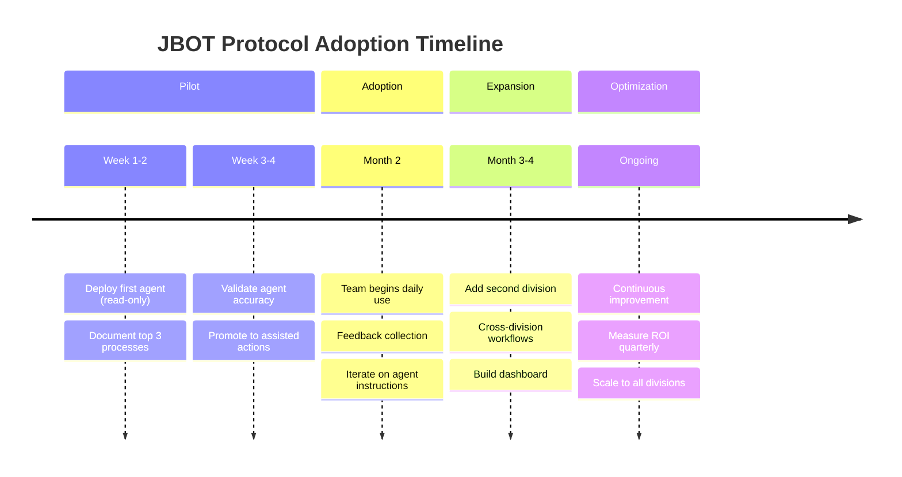

# Pillar 5: Change Management

**$3 change management for every $1 AI development**

---

## Overview

Change Management is the human side of JBOT Protocol—driving adoption, building skills, and measuring success. The technology is the easy part; changing how people work is the real challenge.

## Core Principles

### 5.1 The 3:1 Investment Ratio

For every dollar spent on AI development, plan to spend three dollars on:

- **Training** — Building skills and confidence
- **Communication** — Explaining the why and the how
- **Support** — Helping people through the transition
- **Iteration** — Refining based on feedback

### 5.2 The Adoption Curve

### 5.3 Stakeholder Mapping

| Stakeholder Type | Primary Concern | Key Message |
|------------------|-----------------|-------------|
| Executives | ROI, risk | Strategic advantage, governance |
| Managers | Team productivity | Augmentation, not replacement |
| Individual Contributors | Job security | New skills, higher-value work |
| IT/Security | System integrity | Controls, compliance |

#### RACI Matrix: Who Does What

| Activity | Executive Sponsor | Division Owners | Individual Contributors | IT / Security |
|----------|:-:|:-:|:-:|:-:|
| **Architecture Design** | A | R | C | C |
| **Knowledge Capture** | I | A | R | C |
| **Tool Integration** | I | C | C | R |
| **Governance Policy** | A | R | C | R |
| **Training Development** | I | A | R | C |
| **Pilot Program** | A | R | R | C |
| **Go-Live Decision** | A | R | C | C |
| **Ongoing Operations** | I | R | R | C |
| **Security Reviews** | I | C | I | R |
| **Performance Monitoring** | I | R | C | C |

**R** = Responsible (does the work) | **A** = Accountable (makes the call) | **C** = Consulted | **I** = Informed

**Key insight:** Division Owners (managers) are the linchpin. They are Responsible or Accountable for 7 of 10 activities. If they don't buy in, adoption stalls — regardless of executive sponsorship.

## Implementation Checklist

- [ ] Complete stakeholder analysis
- [ ] Develop communication plan
- [ ] Create training curriculum
- [ ] Establish feedback channels
- [ ] Define success metrics
- [ ] Plan pilot program
- [ ] Build support resources
- [ ] Schedule regular check-ins

## Training Framework

### Level 1: Awareness
- What is JBOT Protocol?
- Why is the organization adopting it?
- What does it mean for me?

### Level 2: Competency
- How do I work with AI agents?
- What are my responsibilities?
- How do I escalate issues?

### Level 3: Mastery
- How do I optimize agent performance?
- How do I contribute to improvement?
- How do I train others?

## Communication Plan

### Pre-Launch

- Executive announcement
- Team briefings
- FAQ documentation
- Concern collection

### During Rollout

- Progress updates
- Success stories
- Issue resolution
- Feedback loops

### Post-Launch

- Metrics sharing
- Improvement announcements
- Recognition and celebration
- Continuous learning

## Success Metrics

### Adoption Metrics

- Active users / Total users
- Tasks completed via agents
- Time to first successful use

### Efficiency Metrics

- Time saved per task
- Error rate reduction
- Throughput increase

### Satisfaction Metrics

- User satisfaction score
- Agent helpfulness rating
- Likelihood to recommend

### Business Metrics

- Cost per transaction
- Customer satisfaction
- Revenue impact

## Common Challenges

### Challenge: Fear of Job Loss

**Response:** Focus on augmentation narrative. Show how agents handle tedious work, freeing people for higher-value activities.

### Challenge: Distrust of AI

**Response:** Start with low-stakes applications. Build confidence through small wins. Maintain human control.

### Challenge: Skill Gaps

**Response:** Invest in training. Provide ongoing support. Celebrate learning.

### Challenge: Process Resistance

**Response:** Involve users in design. Iterate based on feedback. Show results.

## Deliverables

1. **Communication Plan** — Stakeholder messaging strategy
2. **Training Curriculum** — Learning materials and schedules
3. **Success Metrics Dashboard** — KPIs and tracking
4. **Feedback Mechanisms** — Channels for continuous improvement

---

## Related Templates

- [discovery-interview.md](/templates/discovery-interview.md) — Understanding client readiness
