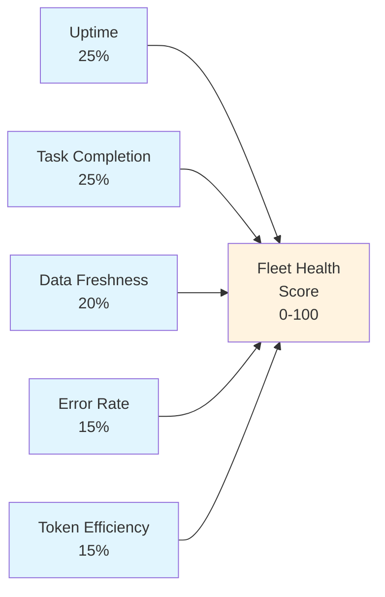

# Pillar 6: Measurement & ROI

**What gets measured gets funded**

---

## Overview

Measurement & ROI is the pillar that sustains everything else. Without clear metrics tied to business outcomes, AI agent programs lose executive sponsorship and wither. This pillar provides the framework for quantifying value, tracking adoption, and making the business case for continued investment.

## Core Principles

### 6.1 The Three Value Categories

Every agent deployment creates value in one or more of these categories:

| Category | Definition | Example |
|----------|-----------|---------|
| **Time Saved** | Hours freed from manual, repetitive work | Agent generates daily reports in 2 minutes vs. 45 minutes manual |
| **Errors Reduced** | Fewer mistakes in data entry, routing, compliance | Ticket categorization accuracy improves from 72% to 95% |
| **Capacity Unlocked** | New capabilities that weren't possible before | Cross-division synthesis that no single person had time to do |

**The order matters.** Time Saved is easiest to measure and most compelling to executives. Start there.

### 6.2 ROI Calculation Framework

```
ROI = (Value Created - Cost of Implementation) / Cost of Implementation x 100

Where:
  Value Created = (Hours Saved x Hourly Rate) + (Errors Avoided x Cost per Error) + Capacity Value
  Cost = API spend + setup time + ongoing maintenance + change management
```

#### Practical Example

| Line Item | Calculation | Monthly Value |
|-----------|-------------|:------------:|
| Daily reports automated (3 divisions) | 3 reports x 45 min x 22 days x $50/hr | $4,950 |
| Order monitoring (manual → automated) | 2 hrs/day x 22 days x $35/hr | $1,540 |
| Ticket categorization errors reduced | 50 errors/mo x 15 min fix x $35/hr | $437 |
| Cross-division synthesis (new capability) | 4 hrs/week x $75/hr | $1,300 |
| **Total monthly value** | | **$8,227** |
| **Monthly cost** (API + maintenance) | | **($800)** |
| **Net monthly ROI** | | **$7,427** |
| **Annual ROI** | ($8,227 x 12 - $9,600) / $9,600 | **928%** |

### 6.3 Metrics Taxonomy

#### Leading Indicators (predict future success)

| Metric | Definition | Target |
|--------|-----------|--------|
| **Adoption Rate** | Active users / Total eligible users | >80% by month 3 |
| **Tasks Completed** | Agent tasks successfully executed per week | Increasing week-over-week |
| **Time to First Value** | Days from agent deployment to first useful output | <5 business days |
| **User Satisfaction** | Weekly pulse survey (1-5 scale) | >4.0 |

#### Lagging Indicators (confirm realized value)

| Metric | Definition | Target |
|--------|-----------|--------|
| **Cost Savings** | Documented reduction in operational costs | Measurable by month 3 |
| **Revenue Impact** | Revenue attributed to agent-enabled activities | Track from month 6 |
| **Error Rate** | Mistakes in agent-handled processes vs. baseline | <50% of pre-agent baseline |
| **Throughput** | Volume of work processed per unit time | >150% of pre-agent baseline |

### 6.4 Human-Agent Ratio (HAR)

The HAR metric tracks how deeply agents are embedded in each division's operations.

```
HAR = Number of Active Agent Tasks / Number of Human FTEs in Division
```

| HAR Range | Interpretation | Maturity Stage |
|-----------|---------------|----------------|
| 0.1 - 0.5 | Agent assists with a few tasks | Pilot |
| 0.5 - 2.0 | Agent handles significant portion of routine work | Adoption |
| 2.0 - 5.0 | Agent is a core team member | Scaled |
| 5.0+ | Division is AI-native | Transformed |

**Tracking methodology:**
1. Count distinct recurring agent tasks per division (daily alerts, weekly reports, etc.)
2. Count human FTEs in the same division
3. Calculate ratio monthly
4. Track trend over time — the trajectory matters more than the absolute number

### 6.5 Dashboarding

Make metrics visible and automatic. A dashboard that requires manual updates won't be updated.

**Recommended stack:**
- **Data store:** Supabase (PostgreSQL) — agent outputs and metrics logged via API
- **Frontend:** Astro + React — lightweight, fast, deployable to Cloudflare Pages
- **Refresh:** Agents write their own metrics as part of task completion (self-reporting)

**Dashboard sections:**

| Section | Metrics | Refresh |
|---------|---------|---------|
| Executive Summary | Total ROI, cost savings, HAR by division | Weekly |
| Adoption | Active users, tasks completed, satisfaction scores | Daily |
| Performance | Response quality, error rates, throughput | Daily |
| Cost | API spend by agent, cost per task, budget vs. actual | Weekly |

## Implementation Checklist

- [ ] Establish baseline metrics before agent deployment
- [ ] Define target KPIs per division
- [ ] Instrument agent tasks to log outcomes automatically
- [ ] Build or configure dashboard
- [ ] Set up weekly metric review cadence
- [ ] Create monthly ROI summary for executive sponsors
- [ ] Review and adjust targets quarterly

## The Sustainability Benchmark

Research from Deloitte's AI scaling studies suggests that organizations need to achieve **45% operational sustainability** — meaning AI-augmented processes must maintain effectiveness for 3+ years without constant rebuilding. This requires:

1. **Feedback loops** — Instrument every agent decision; log human overrides
2. **Continuous improvement** — Monthly review of agent performance; quarterly skill updates
3. **Knowledge maintenance** — SOPs and agent instructions reviewed when processes change
4. **Cost discipline** — Track API spend per task; optimize model selection (use Haiku for simple tasks, Opus for complex)

## Fleet Health Score

A single composite score (0-100) that answers the question: "Is the fleet operating well right now?"

### Weighted 5-Factor Formula



| Factor | Weight | Calculation | Perfect Score |
|--------|:---:|---|---|
| **Uptime** | 25% | (seconds all services were running / total seconds in trailing 24h) x 100 | All bot services running 100% of the time |
| **Task Completion** | 25% | (scheduled jobs that ran successfully / total scheduled jobs) x 100 | Every cron job executed without error |
| **Data Freshness** | 20% | Average of (freshness threshold - actual staleness) / freshness threshold x 100, clamped to 0 | All data sources updated within their expected windows |
| **Error Rate** | 15% | (1 - failed executions / total executions) x 100 | Zero failed executions |
| **Token Efficiency** | 15% | (baseline cost per output - actual cost per output) / baseline cost per output x 100, clamped to 0-100 | Cost per actionable output at or below target baseline |

**Composite formula:**

```
Health Score = (Uptime x 0.25) + (Task Completion x 0.25) + (Data Freshness x 0.20)
             + (Error Rate x 0.15) + (Token Efficiency x 0.15)
```

### Score Interpretation

| Score Range | Status | Recommended Action |
|:-:|---|---|
| **90-100** | Healthy | No action needed; continue monitoring |
| **70-89** | Attention needed | Investigate lowest-scoring factor; schedule maintenance |
| **50-69** | Degraded | Immediate investigation required; check service logs and credential status |
| **Below 50** | Critical | Escalate to operator; consider pausing non-essential agents until root cause is resolved |

### Calculation Cadence

Calculate the health score hourly and write it to the fleet health database table. Display the current score and 7-day trend on the operations dashboard. Alert the operator only when the score drops below 70 for two consecutive calculations (to avoid alerting on transient dips).

## Data Pipeline Architecture

Measurement only works if data flows reliably from agents to dashboards. This section describes the pipeline architecture that makes fleet-wide metrics possible.

### The Database as Nervous System

A shared database (such as Supabase/PostgreSQL) serves as the central nervous system of the fleet. Every bot writes structured data to shared tables as part of its normal task execution. This eliminates the need for a separate data collection layer — the act of doing work and the act of reporting on work are the same operation.

**Benefits of this pattern:**
- No separate ETL pipeline to build or maintain
- Data is available the moment a task completes
- Failed writes surface immediately (the task itself fails), not hours later when a batch job runs
- Dashboard queries hit the same tables that agents write to — no sync lag

### Layered Retention Model

| Data Layer | Retention Period | Storage Format | Query Pattern |
|-----------|:---:|---|---|
| **Real-time** | 7 days | Active database tables (uncompressed rows) | Dashboard queries, health checks, alerting rules |
| **Daily** | 30 days | Aggregated summary rows (one per bot per day) | Trend analysis, weekly reports, performance reviews |
| **Monthly** | 90+ days | Archived summaries (exported or in cold storage) | Quarterly reviews, year-over-year comparisons, board reports |

**Aggregation flow:**
```
Real-time rows (7d) → Daily aggregation job → Daily summary rows (30d) → Monthly rollup → Archive (90d+)
```

### Self-Reporting Principle

Agents log their own metrics as the final step of every task execution. This is not optional instrumentation added later — it is built into the skill template from day one.

Every agent task should record, at minimum:

- **Timestamp** — When the task completed
- **Status** — Success, failure, or skipped (with reason)
- **Duration** — How long the task took to execute
- **Token usage** — Input and output tokens consumed
- **Output summary** — A one-line description of what was produced (or why nothing was produced)

This self-reporting data feeds the Fleet Health Score, the ROI calculations, and the operations dashboard. Without it, measurement depends on external monitoring, which is more fragile and more expensive.

### Example Table Schema

| Table | Purpose | Key Columns |
|-------|---------|-------------|
| `bot_daily_activity` | Per-bot task execution log | bot_name, task_name, status, tokens_used, executed_at |
| `fleet_health` | Health score snapshots | score, uptime, task_completion, data_freshness, error_rate, token_efficiency, calculated_at |
| `narrative_archive` | Executive summaries and reports | bot_name, report_type, content, period_start, period_end, created_at |

## Deliverables

1. **ROI Model** — Spreadsheet with baseline, targets, and actuals
2. **Metrics Dashboard** — Automated tracking of leading and lagging indicators
3. **Monthly ROI Report** — Executive summary with trends and recommendations
4. **HAR Tracking** — Division-level human-agent ratios over time

---

## Related Resources

- [Getting Started Guide](../guides/getting-started.md) — Includes metric setup in Week 3
- [Model Selection Guide](../implementation/model-selection-guide.md) — Cost optimization
