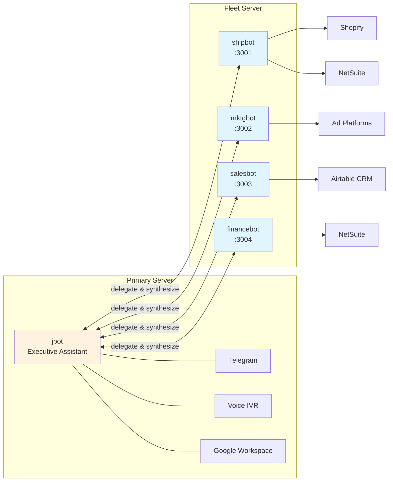
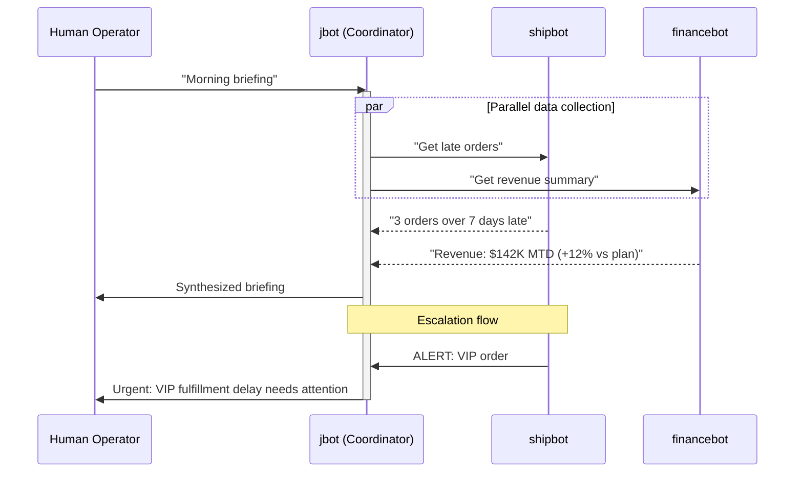

# OpenClaw Fleet Implementation Guide

**Deploying Division-Based AI Agents with OpenClaw**

---

## Overview

This guide documents the implementation of a multi-agent fleet using [OpenClaw](https://openclaw.ai), an open-source AI agent platform. The architecture deploys specialized agents for each business division, connected via messaging integrations (Telegram, phone) and backed by enterprise systems (NetSuite, Shopify, Airtable).

## Architecture

### Two-Server Topology



**Why two servers?**

1. **Isolation**: Fleet bots have production system access (Shopify, NetSuite). Keeping them separate limits blast radius.
2. **Resource allocation**: Each bot runs its own OpenClaw instance with dedicated memory/CPU.
3. **Security**: Personal communications (email, calendar) stay on the primary server.

### Agent Responsibilities

| Agent | Division | Systems Access | Key Functions |
|-------|----------|----------------|---------------|
| **jbot** | Executive | Gmail, Calendar, Airtable | Personal assistant, delegation, synthesis |
| **shipbot** | Fulfillment | Shopify, NetSuite | Order tracking, inventory alerts, late shipment escalation |
| **mktgbot** | Marketing | Meta Ads, Google Ads, Airtable | Campaign performance, content drafting, social scheduling |
| **salesbot** | Sales | Airtable CRM, Shopify | Pipeline tracking, lead scoring, B2B communications |
| **financebot** | Finance | NetSuite, Banking APIs | Revenue dashboards, cash flow, board report compilation |

---

## Installation

### Prerequisites

- Ubuntu 22.04+ or Debian 12+
- Node.js 20+
- OpenClaw account and API key
- Domain with SSL (for webhook endpoints)

### Per-Agent Setup

Each agent runs as an independent OpenClaw instance:

```bash
# Install OpenClaw globally
npm install -g openclaw

# Initialize agent workspace
mkdir -p ~/agents/shipbot
cd ~/agents/shipbot
openclaw init

# Configure (creates ~/.openclaw/openclaw.json)
openclaw config set anthropic.apiKey "YOUR_API_KEY"
openclaw config set gateway.port 3001  # Use unique port per agent
openclaw config set gateway.label "shipbot"
```

### Systemd Service

Create `/etc/systemd/system/shipbot.service`:

```ini
[Unit]
Description=Shipbot - Fulfillment AI Agent
After=network.target

[Service]
Type=simple
User=root
WorkingDirectory=/root/agents/shipbot
Environment="NODE_ENV=production"
ExecStart=/usr/bin/openclaw gateway start
Restart=always
RestartSec=5

[Install]
WantedBy=multi-user.target
```

Enable and start:

```bash
systemctl enable shipbot
systemctl start shipbot
```

Repeat for each agent with unique ports and workspace directories.

---

## Agent Configuration

### Workspace Structure

Each agent has a workspace with identity and knowledge files:

```
~/agents/shipbot/
├── SOUL.md              # Personality and behavior guidelines
├── IDENTITY.md          # Role, responsibilities, communication style
├── USER.md              # User profile (owner info)
├── MEMORY.md            # Long-term memory (curated)
├── TOOLS.md             # Available tools and integrations
├── memory/              # Daily memory files
└── skills/              # Skill files (institutional knowledge)
    ├── late-orders/
    │   └── SKILL.md
    ├── inventory-alerts/
    │   └── SKILL.md
    └── ...
```

### Example: IDENTITY.md for shipbot

```markdown
# Shipbot Identity

I am **Shipbot**, the fulfillment operations agent for Lucyd.

## My Purpose
- Monitor order fulfillment and flag delays
- Track inventory levels and alert on low stock
- Coordinate with carriers and 3PLs
- Provide daily shipping metrics

## My Systems
- Shopify (orders, products, inventory)
- NetSuite (fulfillment, purchasing)
- Shipstation (carrier integrations)

## Communication Style
- Lead with numbers (X orders, Y days late)
- Prioritize actionable alerts
- Escalate anything over 5 days unfulfilled
```

### Skills as Institutional Knowledge

Skills encode how the organization handles specific scenarios. Example skill for late order handling:

```markdown
# SKILL.md - Late Orders Alert

## Trigger
Run daily at 9am ET or when asked about late orders.

## Definition of "Late"
- Standard orders: >3 business days unfulfilled
- Priority orders: >1 business day unfulfilled
- High-value ($500+): >2 business days unfulfilled

## Process
1. Query Shopify for unfulfilled orders
2. Cross-reference NetSuite for shipping status
3. Bucket by age: 3-5 days, 5-7 days, 7+ days
4. Flag any orders on hold (inventory, payment, fraud)
5. Send summary to Telegram with action recommendations

## Escalation
- 7+ days: Ping COO directly
- VIP customer: Immediate notification regardless of age
```

---

## Messaging Integrations

### Telegram

Each agent can have its own Telegram bot for direct access:

```bash
# In agent workspace
openclaw config set channels.telegram.enabled true
openclaw config set channels.telegram.botToken "YOUR_BOT_TOKEN"
```

Alternatively, route all messages through jbot and delegate:

```javascript
// In jbot, route queries to appropriate agent
const message = "What orders are late?";
const response = await fetch('http://your-fleet-server:PORT/api/sessions/send', {
  method: 'POST',
  headers: { 'Authorization': 'Bearer YOUR_TOKEN' },
  body: JSON.stringify({ message })
});
```

### Twilio IVR Phone System

The primary server runs a Node.js handler for voice calls:

```javascript
// IVR Menu Structure
const MENU = {
  '1': { action: 'email_summary', agent: 'jbot' },
  '2': { action: 'calendar', agent: 'jbot' },
  '3': { action: 'todo_list', agent: 'jbot' },
  '4': { action: 'weather', agent: 'jbot' },
  '5': { action: 'project_status', agent: 'jbot' },
  '6': { action: 'voice_query', agent: 'route' },  // Route to appropriate agent
  '7': { action: 'leave_message', agent: 'jbot' },
  '0': { action: 'repeat_menu' }
};
```

Voice queries are transcribed and routed to the appropriate division agent based on content.

---

## Scheduled Agents (Cron)

OpenClaw supports scheduled tasks via the cron tool:

### Daily Morning Briefing

```bash
# Schedule via openclaw CLI or API
openclaw cron add \
  --name "morning-briefing" \
  --schedule "0 9 * * 1-5" \
  --payload '{"kind":"agentTurn","message":"Run morning ops briefing"}' \
  --sessionTarget isolated
```

### Example Agent Tasks

| Agent | Schedule | Task |
|-------|----------|------|
| shipbot | Daily 9am | Late orders alert |
| shipbot | Daily 6pm | End-of-day fulfillment summary |
| mktgbot | Daily 8am | Campaign performance check |
| salesbot | Weekly Mon | Pipeline review |
| financebot | Monthly 1st | Board metrics compilation |

---

## Cross-Agent Communication

Agents can delegate to each other via the sessions_send tool:

```javascript
// jbot receives: "What's our inventory status on Lyte frames?"
// jbot delegates to shipbot:

const response = await sessionsApi.send({
  label: 'shipbot',
  message: 'Check inventory levels for Lyte frames and summarize',
  timeoutSeconds: 30
});

// jbot synthesizes and responds to user
```

### Escalation Chains



---

## Security Considerations

### Principle of Least Privilege

Each agent gets only the API keys it needs:

```bash
# shipbot environment (example)
ECOMMERCE_API_TOKEN=your_token_here
ERP_ACCESS_TOKEN=your_token_here

# salesbot environment  
CRM_API_KEY=your_key_here

# mktgbot environment
ADS_PLATFORM_TOKEN=your_token_here
```

### Human-in-the-Loop

Critical actions require human approval:

1. **External communications**: Drafts queued, not sent
2. **Financial transactions**: Read-only access
3. **System changes**: Alerts only, no autonomous action
4. **Escalations**: Always notify, never auto-resolve

### Audit Trail

All agent actions logged to workspace `logs/` directory. Telegram notifications create persistent record of alerts and decisions.

---

## Monitoring

### Health Checks

Each agent exposes a `/health` endpoint on its configured port:

```bash
curl http://localhost:PORT/health
# {"status":"ok","agent":"shipbot","uptime":"12h"}
```

### Centralized Status

```bash
# Check all agents from primary server
for port in $AGENT_PORTS; do
  curl -s http://your-fleet-server:$port/health | jq '.agent, .status'
done
```

### Alert Thresholds

Configure proactive monitoring:

- Agent offline > 5 minutes → Telegram alert
- Memory usage > 80% → Warning
- Response time > 30s → Performance alert

---

## OpenClaw Ecosystem Updates (2026)

OpenClaw has evolved significantly since this guide was first written. Key updates to leverage:

### ClawHub Skills Registry

Agents can now auto-discover and install skills from the ClawHub marketplace. Instead of manually writing every SKILL.md, check ClawHub for pre-built skills:

```bash
openclaw skills search "late-order-alert"
openclaw skills install @community/ecommerce-alerts
```

This accelerates deployment — community-contributed skills for common operations patterns (inventory monitoring, ticket triage, campaign reporting) can be installed and customized rather than built from scratch.

### Multi-Agent Routing

OpenClaw now natively supports routing channels and accounts to isolated agents. Previously required custom delegation logic; now configurable:

```bash
openclaw config set routing.telegram.shipbot "#fulfillment"
openclaw config set routing.telegram.mktgbot "#marketing"
```

### Additional Features

| Feature | Description | Impact on JBOT Protocol |
|---------|-------------|------------------------|
| **Live Canvas / A2UI** | Agent-driven visual workspace | Dashboard-like interfaces without custom frontend |
| **Voice Wake + Talk Mode** | ElevenLabs integration for always-on speech | Hands-free agent interaction for warehouse/field ops |
| **145K+ GitHub stars** | Largest open-source AI agent platform | Strong community, rapid feature development |

---

## Roadmap

### Phase 1: Foundation ✅
- [x] Multi-agent architecture deployed
- [x] Telegram integration per division
- [x] Phone IVR system
- [x] Basic skills deployed

### Phase 2: Intelligence (Current)
- [ ] Proactive daily briefings
- [ ] Cross-division data synthesis
- [ ] Automated escalation workflows
- [ ] Performance dashboards
- [ ] ClawHub skill integration

### Phase 3: Autonomy (Future)
- [ ] Draft approval workflows
- [ ] Routine action automation (with guardrails)
- [ ] Predictive alerting (forecast-based)
- [ ] Team member onboarding assistance
- [ ] Live Canvas dashboards per division

---

## Related Resources

- [OpenClaw Documentation](https://docs.openclaw.ai)
- [ClawHub Skills Registry](https://hub.openclaw.ai)
- [Claude Code Implementation Guide](./claude-code-guide.md) — Alternative deployment path
- [Model Selection Guide](./model-selection-guide.md) — Cost optimization
- [Framework Templates](/templates)
- [Division Mapping Guide](/framework/01-division-architecture.md)
- [Governance Framework](/framework/04-governance.md)

---

*Last updated: February 2026*
