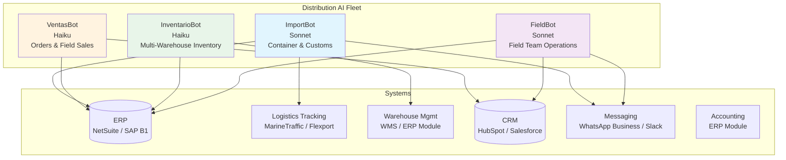
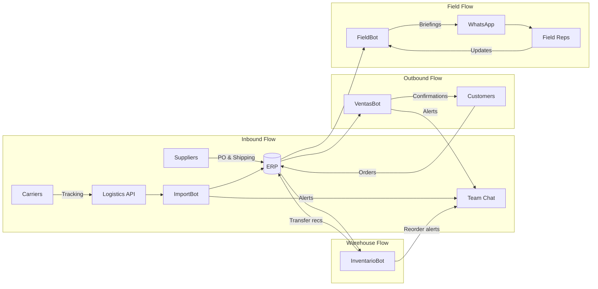

# Industry Template: Import/Export Distribution

**JBOT Protocol configuration for import/export and distribution companies**

---

## 1. Industry Context & Pain Points

Import/export distributors operate in a uniquely complex environment: physical goods moving across oceans, through customs, into warehouses, and out to hundreds of delivery points — all coordinated across time zones, languages, and regulatory regimes. A typical mid-size distributor (100-300 employees, $20-80M revenue) manages 50-200 active containers, 3-8 warehouses, and 40-50 field sales/delivery staff at any given time.

### Top Pain Points

| Pain Point | Impact | Current State |
|-----------|--------|---------------|
| **Container tracking across transit modes** | A single delayed container can cascade into stockouts, lost sales, and demurrage charges ($150-300/day per container) | Manual tracking via carrier websites; operations manager checks 3-5 portals daily |
| **12-hour time zone gap with suppliers** | Communication delays compound daily — a question sent at 4pm local time doesn't get answered until the next morning, burning 24 hours on every exchange | Email chains with factory contacts; WhatsApp messages at odd hours |
| **Field staff coordination** | 40-50 field reps covering delivery routes, collecting payments, and taking orders need daily briefings, route optimization, and real-time inventory visibility | Morning phone calls or group chats; paper route sheets; end-of-day manual reporting |
| **Multi-warehouse inventory** | Product sitting in the wrong warehouse is as bad as being out of stock — internal transfers eat margin and add days to delivery | Weekly inventory counts; Excel consolidation; reactive transfers when stockouts surface |
| **Paper-heavy customs and compliance** | Import documentation (commercial invoices, packing lists, certificates of origin, phytosanitary certificates) is still largely manual and error-prone | Customs broker handles filings; but data entry into broker systems is manual; errors cause holds |

### The Opportunity

Most distributors run on institutional knowledge — the operations manager who knows which port is backlogged, the warehouse lead who knows which products expire first, the field supervisor who knows which customers pay late. AI agents can encode that knowledge, monitor systems continuously, and surface actionable alerts before problems escalate.

---

## 2. Bot Fleet Design

### ImportBot (Sonnet-class)

**Purpose:** Track every container from factory gate to warehouse door, and keep customs documentation ahead of arrivals.

| Capability | Schedule | Details |
|-----------|----------|---------|
| Container status monitoring | Every 4 hours | Polls logistics APIs for status updates on all active shipments; flags delays, reroutes, and holds |
| ETA calculation and alerts | Daily 6:00 AM | Compiles arrival forecasts for all inbound containers; highlights changes from previous forecast |
| Customs document preparation | 7 days before ETA | Generates customs documentation checklists; pre-fills templates from PO data; flags missing documents |
| Supplier communication drafts | Time-zone aware (sends during supplier business hours) | Drafts follow-up messages to suppliers for production updates, shipping confirmations, quality certificates |
| Demurrage risk alerts | Daily | Identifies containers at risk of demurrage charges (arriving without warehouse space, documentation incomplete, customs holds) |
| Weekly logistics summary | Monday 7:00 AM | Container count by status (in production, in transit, at port, cleared, delivered), cost tracking, delay analysis |

**Why Sonnet:** Import operations require nuanced reasoning — interpreting shipping terms, understanding customs requirements by product category, and drafting supplier communications that account for cultural and language context.

### VentasBot (Haiku-class)

**Purpose:** Process orders fast, flag credit risks, and keep the sales pipeline moving.

| Capability | Schedule | Details |
|-----------|----------|---------|
| New order processing | Every 30 min | Monitors incoming orders (EDI, email, portal); validates against inventory and credit limits |
| Customer credit check | On new order | Checks customer account status: credit limit, outstanding balance, payment history, days-past-due |
| Order confirmation generation | On validation | Generates order confirmation with delivery ETA based on current inventory + inbound container schedule |
| Backorder management | Daily 8:00 AM | Reviews all backorders; matches against incoming inventory; notifies customers of updated ETAs |
| Daily sales summary | 5:00 PM | Orders received, orders shipped, backorder status, top customers by volume, credit holds |

**Why Haiku:** Order processing is high-volume, rules-based work. Credit checks follow clear thresholds. Haiku's speed and cost efficiency are ideal for processing dozens of orders daily.

### InventarioBot (Haiku-class)

**Purpose:** Know what is where, what is running low, and what is about to expire — across every warehouse.

| Capability | Schedule | Details |
|-----------|----------|---------|
| Multi-warehouse stock snapshot | Daily 6:00 AM | Consolidated inventory report across all warehouses; highlights imbalances (overstocked here, understocked there) |
| Reorder point alerts | Every 4 hours | Compares current stock against reorder points; factors in inbound containers and average daily consumption |
| Expiry tracking | Daily 7:00 AM | Identifies products approaching expiration within 30/60/90 days; recommends FIFO actions or promotional clearance |
| Transfer recommendations | Daily | Analyzes demand patterns by warehouse region; suggests internal transfers to optimize stock positioning |
| Inventory valuation | Weekly, Monday | Calculates inventory value by warehouse, category, and age; flags slow-moving stock (no movement in 60+ days) |
| Shrinkage monitoring | Weekly | Compares system counts against last physical count; flags locations with variance above threshold |

**Why Haiku:** Inventory monitoring is math-heavy and schedule-driven. The logic (compare stock to reorder point, check expiry dates) is straightforward but needs to run frequently across thousands of SKUs. Haiku handles this at scale with minimal cost.

### FieldBot (Sonnet-class)

**Purpose:** Give every field rep a daily plan and give management real-time visibility into field operations.

| Capability | Schedule | Details |
|-----------|----------|---------|
| Daily route briefing | 5:30 AM | Generates personalized daily briefing for each field rep: delivery stops, collection targets, new customer visits, route sequence |
| Route optimization | 5:30 AM | Sequences stops by geography and priority (deliveries before collections, high-value stops first) |
| Collection tracking | Real-time | Monitors payment collections against targets; alerts field supervisor when reps are behind daily targets |
| End-of-day summary | 6:00 PM | Compiles field activity: deliveries completed, collections made, new orders taken, issues reported |
| Field performance dashboard | Weekly, Friday | Rep-by-rep performance: stops per day, collection rate, order conversion, customer complaints |
| Customer visit intelligence | On-demand | Before visiting a customer, generates briefing: purchase history, outstanding balance, last complaint, product preferences |

**Why Sonnet:** Field operations require judgment — prioritizing stops, interpreting route conditions, generating customer-specific briefings. Sonnet's reasoning capability handles the contextual complexity.

---

## 3. System Integration Map

| System | MCP Connection | Access Level | Used By |
|--------|---------------|:------------:|---------|
| **ERP** (NetSuite, SAP Business One) | Custom MCP server (SQL/API) | Read + limited Write | All bots |
| **Logistics tracking** (MarineTraffic, Flexport, carrier APIs) | API-based MCP | Read-only | ImportBot |
| **Warehouse Management** (WMS module or standalone) | API-based MCP | Read-only | InventarioBot |
| **CRM** (HubSpot, Salesforce) | Native MCP | Read + Write | VentasBot, FieldBot |
| **WhatsApp Business** (via API provider) | API-based MCP | Read + Send | ImportBot, FieldBot |
| **Team Chat** (Slack, Teams) | Native MCP | Read + Post | All bots (internal alerts) |
| **Accounting** (ERP module) | Shared with ERP MCP | Read-only | VentasBot (credit checks) |

**Integration priority order:** ERP first (it is the single source of truth for inventory, orders, and financials), then Logistics APIs (container tracking), then Messaging (field team communication), then CRM.

### Data Flow Architecture

---

## 4. Quick Wins (First 30 Days)

| Week | Quick Win | Bot | Expected Impact |
|:----:|-----------|-----|----------------|
| 1 | **Container arrival alerts** — ImportBot sends daily ETA updates and flags any container with changed arrival date or at risk of demurrage | ImportBot | Demurrage incidents: reduce by 60-70% through early visibility |
| 2 | **Automated reorder points** — InventarioBot monitors stock levels against consumption rates and alerts when items hit reorder thresholds | InventarioBot | Stockout frequency: reduce by 50% in first month |
| 3 | **Field team daily routes** — FieldBot generates optimized daily briefings for each field rep with stops, priorities, and customer intelligence | FieldBot | Field rep efficiency: 15-20% more stops per day |
| 4 | **Order credit screening** — VentasBot checks every incoming order against credit limits and flags holds before warehouse picks the order | VentasBot | Bad debt exposure: reduce by 30-40% |

---

## 5. ROI Estimate

### Assumptions (Conservative)

| Metric | Before | After | Improvement |
|--------|:------:|:-----:|:-----------:|
| Demurrage charges per month | $8,000-15,000 | $2,000-5,000 | 50-70% reduction |
| Stockout incidents per month | 15-25 | 5-8 | ~60% reduction |
| Field rep stops per day | 12-15 | 16-20 | +25-35% |
| Order processing time | 2-4 hours | 15-30 minutes | 85% faster |
| Manual reporting hours per week | 20-30 hours | 3-5 hours | 80% reduction |
| Expired product write-offs per quarter | $15,000-30,000 | $5,000-10,000 | 60% reduction |

### Financial Model (Mid-Size Distributor, $40M Revenue)

| Line Item | Calculation | Annual Value |
|-----------|-------------|:------------:|
| **Demurrage reduction** | $8,000/mo savings x 12 | $96,000 |
| **Stockout recovery** | 10 fewer stockouts/mo x $2,000 avg lost margin | $240,000 |
| **Field efficiency gains** | 4 more stops/day x 45 reps x 250 days x $25 margin/stop | $1,125,000 |
| **Reporting automation** | 20 hrs/week x $35/hr x 50 weeks | $35,000 |
| **Expired product reduction** | $15,000/quarter savings | $60,000 |
| **AI system cost** | 4 bots, infrastructure, maintenance | ($24,000-36,000) |
| **Net annual value** | | **$1.5M+ in value created** |

---

## 6. Implementation Phases

### Phase 1: Foundation (Days 1-30)

| Task | Week | Details |
|------|:----:|---------|
| ERP integration setup | 1 | Build MCP connection to ERP; validate read access to inventory, orders, POs |
| InventarioBot deployment (read-only) | 1-2 | Daily stock snapshots and reorder alerts; human validates accuracy for 2 weeks |
| Logistics API integration | 2 | Connect to carrier tracking APIs; ImportBot begins monitoring containers |
| ImportBot live alerts | 3-4 | Container ETA alerts and demurrage warnings; team validates for 1 week then goes live |
| Quick win review | 4 | Assess alert accuracy, team adoption, first-month metrics |

### Phase 2: Expansion (Days 31-60)

| Task | Week | Details |
|------|:----:|---------|
| VentasBot order processing | 5-6 | Credit checks and order validation; runs in parallel with existing process for first 2 weeks |
| FieldBot daily briefings | 6-7 | Pilot with 10 field reps; iterate on briefing format based on feedback |
| WhatsApp integration | 7-8 | Connect messaging API; ImportBot sends supplier follow-ups; FieldBot sends rep briefings |
| FieldBot full rollout | 8 | Expand to all field reps after pilot validation |

### Phase 3: Intelligence (Days 61-90)

| Task | Week | Details |
|------|:----:|---------|
| Cross-bot orchestration | 9-10 | ImportBot arrival data feeds InventarioBot (incoming stock); VentasBot backorders auto-update on container arrival |
| Transfer optimization | 10-11 | InventarioBot begins recommending inter-warehouse transfers based on regional demand patterns |
| Executive dashboards | 11-12 | Consolidated reporting: logistics performance, inventory health, field productivity, credit exposure |
| Performance review and Phase 2 planning | 12 | Full ROI assessment, process refinements, expansion roadmap (predictive analytics, demand forecasting) |

---

## 7. Key Customizations vs Core Framework

| Core Framework Element | Import/Export Customization |
|-----------------------|---------------------------|
| **Division Architecture** | Divisions map to supply chain stages: procurement/import, warehousing, sales/distribution, field operations |
| **Knowledge Capture** | Heavy focus on trade compliance knowledge, supplier relationship nuances, and route/territory expertise |
| **Tool Integration** | Logistics tracking APIs are unique to this vertical; WhatsApp is often the primary communication channel (not Slack/Teams) |
| **Governance** | Customs documentation requires strict accuracy — errors cause shipment holds. Extra validation layer for ImportBot outputs |
| **Change Management** | Field staff may have limited tech literacy; mobile-first delivery (WhatsApp briefings, not web dashboards) is critical |
| **Measurement & ROI** | Demurrage reduction and field efficiency are the most compelling ROI metrics for this audience |

### Industry-Specific Considerations

- **Bilingual operations:** Many import/export businesses operate in two or more languages. Bots must generate content in the appropriate language for each audience (e.g., Spanish for field teams, English for executive reports, Mandarin/Vietnamese/etc. for supplier communications)
- **WhatsApp as primary channel:** In many markets, WhatsApp Business is the dominant communication tool for field teams and even customers. Build around it, not around email
- **Compliance document generation:** Import documentation (commercial invoices, packing lists, certificates of origin) follows strict formats. ImportBot should generate pre-filled templates, not free-form documents
- **Seasonal and perishable inventory:** Many distributors handle products with expiry dates or seasonal demand. InventarioBot must prioritize FIFO enforcement and seasonal demand adjustments
- **Cash-on-delivery markets:** In some distribution markets, field reps collect cash. FieldBot must track daily collections against targets and flag discrepancies immediately
- **Currency and exchange rates:** Multi-country operations deal with fluctuating exchange rates that affect margins. ImportBot should flag significant rate movements that impact landed cost

---

## Related Resources

- [JBOT Protocol — Division Architecture](../framework/01-division-architecture.md)
- [JBOT Protocol — Tool Integration](../framework/03-tool-integration.md)
- [JBOT Protocol — Measurement & ROI](../framework/06-measurement-roi.md)
- [Industry Templates Index](./README.md)
