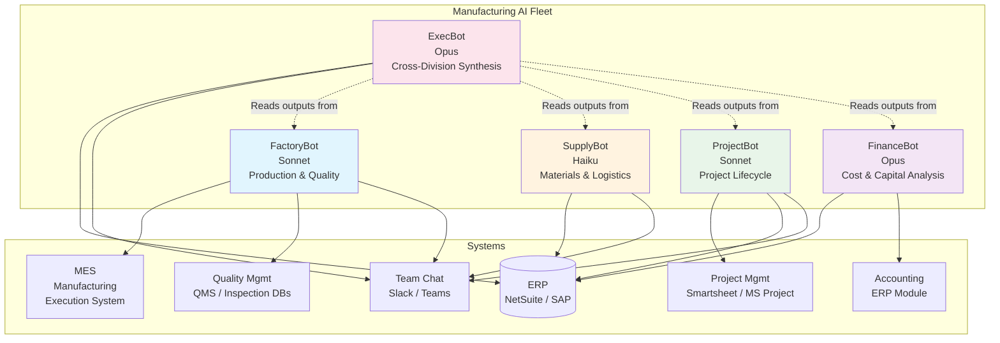
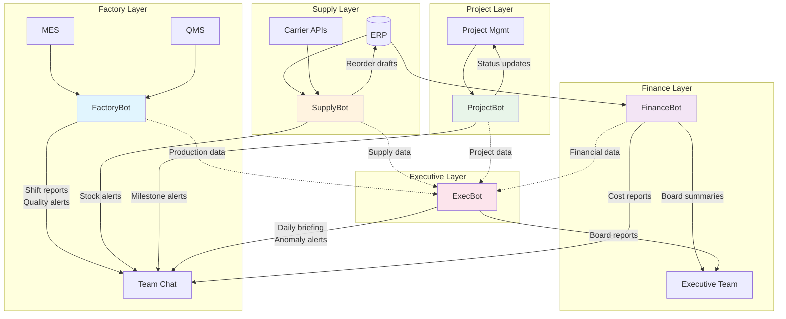

# Industry Template: Manufacturing Operations

**JBOT Protocol configuration for vertically integrated manufacturers**

---

## 1. Industry Context & Pain Points

Vertically integrated manufacturers — companies that control multiple stages from raw materials through finished goods — face a unique data challenge: critical information is scattered across factory floors, supply chain systems, project management tools, and financial ledgers. A typical mid-size manufacturer (200-500 employees, $30-150M revenue) operates 1-3 production facilities, manages dozens of active projects or product lines, and must synthesize data across layers that rarely talk to each other.

### Top Pain Points

| Pain Point | Impact | Current State |
|-----------|--------|---------------|
| **Cross-layer data synthesis** | Leadership decisions require combining factory output data, supply chain status, sales forecasts, and financial metrics — but each lives in a different system with different owners | Weekly meetings where division heads present their view; nobody has the full picture between meetings |
| **Project lifecycle tracking** | Capital projects, new product launches, and customer orders each have 20-50 milestones across departments — missed handoffs cause cascading delays | Spreadsheets, Gantt charts updated manually, project managers chasing updates via email |
| **Quality control monitoring** | Defect rates, scrap percentages, and rework hours are tracked at the line level but rarely synthesized into executive-level quality metrics | Quality team produces monthly reports; problems surface weeks after they begin |
| **Production scheduling** | Balancing machine capacity, labor availability, material readiness, and customer priority across multiple production lines | Master scheduler maintains a complex spreadsheet; schedule breaks happen 2-3 times per week |
| **Capital expenditure justification** | New equipment, facility expansions, and automation investments require business cases that pull data from production, finance, and sales | CFO requests data from 3-4 departments; assembly takes 2-3 weeks per CapEx request |

### The Opportunity

Manufacturing generates enormous amounts of data — machine outputs, quality measurements, material consumption, labor hours, project milestones — but most of it sits in siloed systems. The executive team typically operates with a 1-2 week data lag. AI agents can collapse that lag to near-zero and synthesize cross-layer insights that would require a team of analysts to produce manually.

---

## 2. Bot Fleet Design

### FactoryBot (Sonnet-class)

**Purpose:** Monitor production output and quality metrics in real time; surface problems before they become costly.

| Capability | Schedule | Details |
|-----------|----------|---------|
| Shift production summary | End of each shift | Compiles output vs. target, machine utilization, downtime events, and labor hours per production line |
| Quality metrics dashboard | Every 4 hours | Aggregates defect rates, scrap percentages, rework hours, and first-pass yield across all lines |
| Downtime analysis | On event + daily summary | Categorizes unplanned downtime (mechanical, material, quality hold, operator) and tracks against historical baselines |
| Maintenance schedule monitoring | Daily 6:00 AM | Cross-references PM (preventive maintenance) schedule against actual completion; flags overdue maintenance |
| Safety incident tracking | Real-time | Monitors safety reports; escalates incidents immediately; compiles weekly safety summary |
| Weekly production report | Monday 7:00 AM | Comprehensive production review: output, efficiency, quality, downtime, safety, labor utilization |

**Why Sonnet:** Production monitoring requires interpreting patterns — distinguishing a normal variance from an emerging problem, correlating a quality spike with a raw material batch change. Sonnet's reasoning handles these contextual judgments.

### SupplyBot (Haiku-class)

**Purpose:** Track raw materials from vendor to factory floor and ensure production never stops waiting for materials.

| Capability | Schedule | Details |
|-----------|----------|---------|
| Raw material inventory levels | Every 4 hours | Monitors stock of key raw materials against consumption rates and reorder points |
| Vendor lead time tracking | Daily 7:00 AM | Compares actual lead times against contracted lead times; flags vendors consistently delivering late |
| Container and logistics tracking | Every 6 hours | Tracks inbound shipments from international and domestic suppliers; ETA updates and delay alerts |
| Reorder generation | Daily | When materials hit reorder point, generates draft PO with recommended quantities based on production forecast |
| Vendor performance scorecard | Monthly | Compiles on-time delivery rate, quality rejection rate, price variance, and responsiveness for each vendor |
| Cost variance alerts | On receipt | Compares actual landed cost against quoted cost; flags variances above threshold |

**Why Haiku:** Supply chain monitoring is high-frequency, rules-based work — compare stock to thresholds, track ETAs against dates, calculate variances. Haiku handles the volume and speed requirements at minimal cost.

### ProjectBot (Sonnet-class)

**Purpose:** Track every project milestone across departments and surface delays before they cascade.

| Capability | Schedule | Details |
|-----------|----------|---------|
| Project milestone tracking | Daily 8:00 AM | Scans all active projects for upcoming milestones (7-day lookahead); flags at-risk items |
| Cross-department dependency alerts | Daily | Identifies tasks blocked by other departments' deliverables; notifies both the blocker and the blocked |
| Resource allocation monitoring | Twice weekly | Tracks key resources (engineering hours, machine time, tooling) across projects; flags overallocation |
| Project health dashboard | Monday + Thursday | RAG status (Red/Amber/Green) for every active project: timeline, budget, scope, quality |
| Milestone completion reporting | On completion | When a milestone is marked complete, generates status update and triggers downstream task notifications |
| Executive project portfolio view | Weekly, Friday | Consolidated view: all projects by phase, total investment, timeline risk, resource utilization |

**Why Sonnet:** Project management involves understanding dependencies, interpreting status updates from multiple sources, and making judgment calls about risk levels. Sonnet's reasoning is needed for accurate RAG assessments.

### FinanceBot (Opus-class)

**Purpose:** Turn manufacturing data into financial intelligence — cost analysis, margin tracking, and CapEx justification.

| Capability | Schedule | Details |
|-----------|----------|---------|
| Product cost analysis | Weekly | Calculates actual vs. standard cost per product line: materials, labor, overhead allocation, scrap |
| Margin tracking | Daily 9:00 AM | Tracks gross margin by product, customer, and channel; flags margin erosion (3+ consecutive days below target) |
| CapEx business case generation | On demand | Given a proposed investment (new machine, facility expansion, automation), pulls historical data and generates financial model: payback period, IRR, NPV |
| Cash flow monitoring | Daily | Monitors AP/AR, inventory value, and working capital; alerts on cash flow pressure points |
| Board-ready financial summaries | Monthly | Compiles manufacturing financial performance: revenue, COGS breakdown, margin analysis, CapEx status, working capital metrics |
| Budget variance analysis | Weekly | Compares actual spend against budget by department and category; flags variances above 10% |

**Why Opus:** Financial analysis for manufacturing involves complex reasoning — allocating shared costs, normalizing for volume changes, building credible investment models. Errors in financial reporting have outsized consequences. Opus's accuracy justifies the cost.

### ExecBot (Opus-class)

**Purpose:** Synthesize information across all layers and deliver a unified operating picture to leadership.

| Capability | Schedule | Details |
|-----------|----------|---------|
| Daily executive briefing | 7:00 AM | Cross-division summary: production status, supply chain alerts, project health, financial highlights, safety incidents |
| Anomaly detection | Continuous (every 2 hours) | Scans outputs from all other bots for unusual patterns — quality spike + supplier delivery delay + project milestone miss = potential systemic issue |
| Weekly operations review prep | Friday 3:00 PM | Compiles full weekly review packet: KPIs by division, notable events, decisions needed, forward-looking risks |
| Monthly board report | Last Friday of month | Board-ready operations summary: production metrics, quality trends, project portfolio, financial performance, strategic initiatives |
| Ad-hoc analysis | On demand | Answers cross-functional questions from leadership: "What's the real cost of the quality issues we had last month?" or "If we accelerate Project X, what resources do we need to pull from where?" |

**Why Opus:** Cross-division synthesis is the hardest task in the fleet. ExecBot must reason across production data, supply chain status, project timelines, and financial metrics to produce coherent executive narratives. This is Opus territory.

---

## 3. System Integration Map

| System | MCP Connection | Access Level | Used By |
|--------|---------------|:------------:|---------|
| **ERP** (NetSuite, SAP, Epicor) | Custom MCP server (SQL/API) | Read + limited Write | All bots |
| **MES** (Manufacturing Execution System) | API-based MCP or database MCP | Read-only | FactoryBot |
| **Quality Management** (QMS, inspection databases) | API or database MCP | Read-only | FactoryBot |
| **Project Management** (Smartsheet, MS Project, Monday.com) | API-based MCP | Read + Write (status updates) | ProjectBot |
| **Accounting** (ERP module or standalone) | Shared with ERP MCP | Read-only | FinanceBot |
| **Team Chat** (Slack, Teams) | Native MCP | Read + Post | All bots |
| **Document Management** (SharePoint, Google Drive) | API-based MCP | Read-only | ProjectBot, ExecBot |

**Integration priority order:** ERP first (financial and inventory data), then MES (production data), then Project Management, then Team Chat for alerts.

### Data Flow Architecture

---

## 4. Quick Wins (First 30 Days)

| Week | Quick Win | Bot | Expected Impact |
|:----:|-----------|-----|----------------|
| 1 | **Production shift summaries** — FactoryBot generates end-of-shift reports automatically; supervisors review instead of compiling | FactoryBot | Reporting time: 45 min/shift to 5 min/shift |
| 2 | **Raw material reorder alerts** — SupplyBot monitors stock against reorder points and flags items before they hit safety stock levels | SupplyBot | Material stockouts: reduce by 50-60% |
| 3 | **Cross-division daily briefing** — ExecBot synthesizes production, supply, and project data into a single morning summary for leadership | ExecBot | Executive prep time: 1-2 hours/day to 10 min/day |
| 4 | **Project milestone alerts** — ProjectBot sends deadline reminders and dependency flags across departments | ProjectBot | Late milestone awareness: days earlier |

---

## 5. ROI Estimate

### Assumptions (Conservative)

| Metric | Before | After | Improvement |
|--------|:------:|:-----:|:-----------:|
| Unplanned downtime per month | 40-60 hours | 25-35 hours | 35-40% reduction |
| Scrap rate | 3-5% | 2-3.5% | 1-1.5% improvement |
| Project milestone on-time rate | 65-75% | 85-90% | 15-20% improvement |
| Executive reporting hours per week | 15-25 hours | 3-5 hours | 80% reduction |
| CapEx justification cycle time | 2-3 weeks | 3-5 days | 70% faster |
| Material stockout incidents per month | 8-12 | 2-4 | 65% reduction |

### Financial Model (Mid-Size Manufacturer, $60M Revenue)

| Line Item | Calculation | Annual Value |
|-----------|-------------|:------------:|
| **Downtime reduction** | 20 hours/mo saved x $5,000/hr (fully loaded) | $1,200,000 |
| **Scrap rate improvement** | 1% improvement on $25M material cost | $250,000 |
| **Material stockout avoidance** | 7 fewer incidents/mo x $5,000 avg cost | $420,000 |
| **Reporting automation** | 18 hrs/week x $50/hr x 50 weeks | $45,000 |
| **Project acceleration** | 15% faster project delivery on $5M project portfolio | $750,000 (opportunity cost) |
| **AI system cost** | 5 bots, infrastructure, maintenance | ($36,000-60,000) |
| **Net annual value** | | **$2.6M+ in value created** |

*Note: Downtime and scrap improvements are the highest-confidence ROI items — they are directly measurable and historically benchmarked. Project acceleration value is an estimate of opportunity cost recovery.*

---

## 6. Implementation Phases

Manufacturing is more complex than most industries due to the number of systems, the criticality of production continuity, and the need for safety compliance. This template uses a 4-phase, 120-day approach.

### Phase 1: Foundation (Days 1-30)

| Task | Week | Details |
|------|:----:|---------|
| ERP integration setup | 1-2 | Build MCP connection to ERP; validate read access to inventory, orders, cost data, and GL |
| MES integration | 2-3 | Connect to production monitoring system; validate output data, downtime codes, quality measurements |
| FactoryBot deployment (read-only) | 3-4 | Shift summaries and quality dashboards; production team validates accuracy for 2 weeks |
| SupplyBot reorder monitoring | 3-4 | Material level alerts; procurement team validates thresholds |

### Phase 2: Expansion (Days 31-60)

| Task | Week | Details |
|------|:----:|---------|
| ExecBot daily briefing | 5-6 | Synthesize FactoryBot and SupplyBot outputs into executive morning summary |
| ProjectBot deployment | 6-7 | Connect to project management tool; begin milestone tracking and dependency monitoring |
| FactoryBot write access | 7-8 | Enable alerts to team chat; automated escalation for quality holds and safety incidents |
| Integration hardening | 8 | Error handling, retry logic, monitoring dashboards for all connections |

### Phase 3: Financial Intelligence (Days 61-90)

| Task | Week | Details |
|------|:----:|---------|
| FinanceBot deployment | 9-10 | Cost analysis and margin tracking; finance team validates against manual reports for 2 weeks |
| Cross-bot orchestration | 10-11 | FactoryBot quality data feeds FinanceBot (scrap cost); SupplyBot data feeds FinanceBot (material cost variance) |
| ExecBot full synthesis | 11-12 | Add financial and project layers to executive briefing; weekly operations review packet |
| Budget variance automation | 12 | FinanceBot begins weekly budget variance analysis with department-level breakdowns |

### Phase 4: Optimization (Days 91-120)

| Task | Week | Details |
|------|:----:|---------|
| CapEx justification workflows | 13-14 | FinanceBot generates business case templates from production + financial data |
| Predictive maintenance signals | 14-15 | FactoryBot begins correlating downtime patterns with maintenance schedules to predict failures |
| Board reporting automation | 15-16 | Monthly board report compilation: ExecBot + FinanceBot collaborate on production, financial, and strategic metrics |
| Full review and roadmap | 16 | 120-day ROI assessment, lessons learned, expansion plan (predictive analytics, demand planning, simulation) |

---

## 7. Key Customizations vs Core Framework

| Core Framework Element | Manufacturing Customization |
|-----------------------|----------------------------|
| **Division Architecture** | Divisions map to operational layers: factory/production, supply chain, project management, finance, executive |
| **Knowledge Capture** | Heavy focus on production process knowledge (machine settings, quality specifications, troubleshooting decision trees), safety protocols, and cost allocation methodologies |
| **Tool Integration** | MES integration is unique to manufacturing; quality management systems vary widely (from paper to sophisticated QMS software) |
| **Governance** | Safety-critical: FactoryBot recommendations must never override safety protocols. Financial data governance is strict for public companies |
| **Change Management** | Factory floor teams may resist monitoring as "surveillance" — frame as decision support, not oversight. Involve shift supervisors in design |
| **Measurement & ROI** | OEE (Overall Equipment Effectiveness) is the manufacturing north star. Downtime, scrap, and first-pass yield are the leading indicators |

### Manufacturing-Specific Considerations

- **Safety compliance:** In regulated manufacturing environments (food, pharma, aerospace), AI outputs that affect production decisions may require documentation trails. Build audit logging into every bot from day one
- **Shift-based operations:** Manufacturing runs in shifts (often 2-3 per day). Bot schedules must align with shift handoffs. The end-of-shift summary is the most critical daily deliverable — it is the handoff document between shifts
- **Multi-site coordination:** Manufacturers with 2+ facilities need bots that can compare performance across sites without creating unhealthy competition. Frame metrics as "best practice identification" not "ranking"
- **Union environments:** In unionized facilities, any system that tracks individual worker productivity is sensitive. Design FactoryBot to report at the line/shift level, not the individual level, unless the organization explicitly requests otherwise
- **Seasonal demand:** Many manufacturers face seasonal spikes. SupplyBot must incorporate demand forecasts (not just historical averages) when calculating reorder points during ramp-up periods
- **Capital intensity:** Manufacturing CapEx decisions are high-stakes ($500K-$10M+). FinanceBot's business case generation must be conservative and auditable — leadership will scrutinize the assumptions
- **Continuous improvement culture:** Many manufacturers run Lean, Six Sigma, or similar programs. Position AI agents as an acceleration of continuous improvement, not a replacement for it. FactoryBot's quality metrics feed directly into existing CI workflows

---

## Related Resources

- [JBOT Protocol — Division Architecture](../framework/01-division-architecture.md)
- [JBOT Protocol — Governance](../framework/04-governance.md)
- [JBOT Protocol — Measurement & ROI](../framework/06-measurement-roi.md)
- [Case Study: Anonymized Fleet Implementation](../case-studies/anonymized-implementation.md)
- [Industry Templates Index](./README.md)
