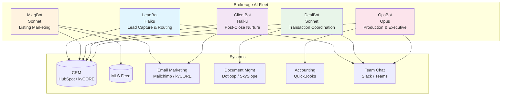

# Industry Template: Real Estate Brokerage

**JBOT Protocol configuration for residential real estate brokerages**

---

## 1. Industry Context & Pain Points

Residential real estate brokerages operate in one of the most relationship-driven, time-sensitive industries. A typical mid-size brokerage (20-80 agents) juggles hundreds of active leads, dozens of pending transactions, and a constant stream of new listings — all coordinated across independent contractor agents who may or may not follow the brokerage's systems.

### Top Pain Points

| Pain Point | Impact | Current State |
|-----------|--------|---------------|
| **Speed-to-lead** | Studies show leads contacted within 5 minutes are 10x more likely to convert than those contacted at 30 minutes. Most brokerages average 2-6 hours | Manual lead routing via email notification; agents check when they check |
| **Agent commission tracking** | Disputes over splits, referral fees, and cap tracking create friction between agents and the brokerage | Spreadsheets or basic CRM reports; reconciliation happens monthly |
| **Listing coordination** | Photography, staging, inspections, signage — each listing requires 15-20 coordination tasks | Checklists in agents' heads; things get missed |
| **Marketing automation** | Listings need social posts, email blasts, and print materials within 24 hours of going live | Manual creation or expensive third-party tools with rigid templates |
| **Post-close nurture** | 80% of buyers say they would use their agent again, but only 12% actually do | Birthday cards if the agent remembers; most clients get zero post-close contact |

### The Opportunity

A brokerage with 50 agents closing 300 transactions per year has roughly 3,000-5,000 active leads, 50-80 pending transactions, and 300+ past clients at any given time. No human operations team can keep meaningful contact with all of them. AI agents can.

---

## 2. Bot Fleet Design

### LeadBot (Haiku-class)

**Purpose:** Ensure no lead waits more than 60 seconds for a response.

| Capability | Schedule | Details |
|-----------|----------|---------|
| Lead capture monitoring | Real-time (every 2 min) | Polls CRM for new leads from all sources (website, portal, referral, sign call) |
| Speed-to-lead routing | Event-triggered | Matches lead to best-fit agent based on: geography, price range, availability, specialization |
| Qualification scoring | On new lead | Scores leads 1-10 based on: timeline, pre-approval status, motivation signals, price range |
| Unresponsive agent escalation | Every 15 min | If assigned agent hasn't contacted lead within 5 minutes, escalates to backup agent or team lead |
| Daily lead summary | 7:00 AM | New leads, response times, conversion rates, uncontacted leads alert |

**Why Haiku:** Lead routing is pattern-matching at speed. The tasks are high-frequency, low-complexity. Haiku's fast response time and low cost make it ideal for near-real-time monitoring.

### MktgBot (Sonnet-class)

**Purpose:** Turn every listing into a multi-channel marketing campaign within 24 hours.

| Capability | Schedule | Details |
|-----------|----------|---------|
| New listing detection | Every 30 min | Monitors MLS feed for new listings from brokerage agents |
| Listing description generation | On new listing | Generates MLS description, social captions, email copy from listing data + photos |
| Social media scheduling | On new listing | Creates and schedules posts across platforms (Instagram, Facebook, LinkedIn) |
| Email campaign creation | On new listing | Builds "Just Listed" email for agent's sphere; schedules "Open House" and "Price Reduction" emails |
| Market update content | Weekly, Friday | Generates neighborhood market update content using MLS data for agent social accounts |

**Why Sonnet:** Marketing content requires creativity and brand-voice consistency. Sonnet balances quality writing with reasonable cost for the volume of listings a brokerage produces.

### DealBot (Sonnet-class)

**Purpose:** Ensure no transaction deadline is missed and no coordination task falls through the cracks.

| Capability | Schedule | Details |
|-----------|----------|---------|
| Transaction milestone tracking | Daily 8:00 AM | Reviews all pending transactions; flags upcoming deadlines (inspection, appraisal, financing contingency, closing) |
| Document status monitoring | Every 4 hours | Checks document management system for missing signatures, unsigned disclosures, incomplete forms |
| Deadline alerts | Event-triggered | Sends alerts to agent and transaction coordinator 72h, 48h, and 24h before each deadline |
| Weekly pipeline review | Monday 9:00 AM | Full pipeline summary: pending count, expected closings this week/month, at-risk deals |
| Closing coordination | 5 days before close | Generates closing checklist: title company confirmation, utility transfers, key handoff, walk-through scheduling |

**Why Sonnet:** Transaction coordination requires understanding nuanced contract language and juggling multiple interdependent deadlines. Sonnet handles the reasoning complexity well.

### ClientBot (Haiku-class)

**Purpose:** Keep past clients engaged so they refer and return.

| Capability | Schedule | Details |
|-----------|----------|---------|
| Home anniversary reminders | Daily 8:00 AM | Identifies clients approaching 1-year, 3-year, 5-year home anniversaries; drafts personalized message for agent to send |
| Home value updates | Quarterly | Generates CMA-lite report for past clients showing estimated home value change; agent sends as touchpoint |
| Referral request campaigns | 6 months post-close | Drafts referral request email/text for agent review; tracks referral pipeline |
| Life event monitoring | Weekly | Scans CRM notes and public data for life events (job changes, new baby, etc.) that trigger outreach |
| Re-engagement campaigns | Monthly | Identifies past clients with zero contact in 12+ months; generates re-engagement sequence for agent |

**Why Haiku:** Nurture tasks are templated and high-volume. The personalization layer is light (name, home details, anniversary date). Haiku handles this efficiently at scale.

### OpsBot (Opus-class)

**Purpose:** Give the broker-owner a real-time operating picture of the entire brokerage.

| Capability | Schedule | Details |
|-----------|----------|---------|
| Production tracking | Daily 7:00 AM | Agent-by-agent production report: listings taken, contracts written, closings, GCI |
| Commission reconciliation | Weekly, Monday | Reconciles CRM deal data against accounting system; flags discrepancies in splits, caps, referral fees |
| Recruiting intelligence | Bi-weekly | Analyzes market data to identify high-producing agents at competing brokerages; drafts outreach notes |
| Executive briefing | Daily 7:30 AM | Cross-division synthesis: leads, marketing, deals, client satisfaction, financial health |
| Quarterly business review prep | Quarterly | Compiles QBR deck data: market share trends, agent productivity, revenue per agent, marketing ROI |

**Why Opus:** Executive reporting and commission reconciliation require high-stakes accuracy and cross-system synthesis. Opus's superior reasoning justifies the cost for these critical, lower-frequency tasks.

---

## 3. System Integration Map

| System | MCP Connection | Access Level | Used By |
|--------|---------------|:------------:|---------|
| **CRM** (HubSpot, kvCORE, Follow Up Boss) | Native MCP or API-based MCP | Read + Write | All bots |
| **MLS Feed** (RETS/RESO Web API) | Custom MCP server | Read-only | MktgBot, OpsBot |
| **Email Marketing** (Mailchimp, kvCORE) | API-based MCP | Read + Write | MktgBot, ClientBot |
| **Document Management** (Dotloop, SkySlope) | API-based MCP | Read-only | DealBot |
| **Accounting** (QuickBooks, Lone Wolf) | API-based MCP | Read-only | OpsBot |
| **Team Chat** (Slack, Teams) | Native MCP | Read + Post | LeadBot, DealBot, OpsBot |
| **Calendar** (Google Calendar, Outlook) | API-based MCP | Read-only | LeadBot, DealBot |

**Integration priority order:** CRM first (it is the hub), then Team Chat (for alerts), then MLS + Document Management, then everything else.

---

## 4. Quick Wins (First 30 Days)

| Week | Quick Win | Bot | Expected Impact |
|:----:|-----------|-----|----------------|
| 1 | **Lead response automation** — LeadBot monitors new leads and routes to agents within 60 seconds, with escalation at 5 minutes | LeadBot | Response time: 2-6 hours to under 5 minutes |
| 2 | **Listing marketing templates** — MktgBot generates social + email content for every new listing within 2 hours | MktgBot | Marketing launch time: 2-3 days to under 24 hours |
| 3 | **Transaction deadline alerts** — DealBot sends 72h/48h/24h alerts for every milestone across all pending deals | DealBot | Missed deadlines: reduce by 80%+ |
| 4 | **Daily production dashboard** — OpsBot delivers morning briefing with agent production, pipeline health, and revenue forecast | OpsBot | Broker prep time: 45 min/day to 5 min/day |

---

## 5. ROI Estimate

### Assumptions (Conservative)

| Metric | Before | After | Improvement |
|--------|:------:|:-----:|:-----------:|
| Lead response time | 2-6 hours | <1 minute | 120-360x faster |
| Lead-to-appointment conversion | 3% | 6% | 2x (industry data: speed-to-lead doubles conversion) |
| Admin hours per agent per week | 10 hours | 2 hours | 8 hours saved |
| Listings marketed within 24 hours | 30% | 95% | 3x more timely |
| Past client touches per year | 1-2 | 8-12 | 5x more engagement |
| Missed transaction deadlines per month | 3-5 | 0-1 | ~85% reduction |

### Financial Model (50-Agent Brokerage)

| Line Item | Calculation | Annual Value |
|-----------|-------------|:------------:|
| **Additional closings from better lead conversion** | 3% improvement on 5,000 leads x $8,000 avg GCI | +$1,200,000 GCI |
| **Agent time savings** | 8 hrs/week x 50 agents x $30/hr x 50 weeks | $600,000 in recovered productivity |
| **Reduced admin staff need** | 1 fewer transaction coordinator | $55,000 saved |
| **AI system cost** | 5 bots, estimated token + infrastructure | ($18,000-30,000) |
| **Net annual value** | | **$1.8M+ in value created** |

*Note: GCI impact accrues to agents, not directly to brokerage. Brokerage benefits through retention, splits, and volume. Agent productivity gains are the primary value driver.*

---

## 6. Implementation Phases

### Phase 1: Foundation (Days 1-30)

| Task | Week | Details |
|------|:----:|---------|
| CRM audit and cleanup | 1 | Ensure lead sources are tagged, pipeline stages are defined, contact data is clean |
| LeadBot deployment (read-only) | 1-2 | Monitor leads and generate routing recommendations; human reviews before acting |
| LeadBot live routing | 2-3 | Enable automated routing after validation period |
| DealBot deadline monitoring | 3-4 | Read-only: scan transactions and surface upcoming deadlines |
| Quick win review | 4 | Assess lead response times, missed deadlines, team feedback |

### Phase 2: Expansion (Days 31-60)

| Task | Week | Details |
|------|:----:|---------|
| MktgBot listing automation | 5-6 | Content generation for new listings; human reviews first 10 before auto-publish |
| DealBot write access | 6-7 | Enable automated alerts to agents and transaction coordinators |
| ClientBot nurture sequences | 7-8 | Past client anniversary and referral campaigns; agent approves before send |
| Integration hardening | 8 | Resolve API rate limits, error handling, monitoring dashboards |

### Phase 3: Intelligence (Days 61-90)

| Task | Week | Details |
|------|:----:|---------|
| OpsBot executive reporting | 9-10 | Daily briefings, production dashboards, commission reconciliation |
| Cross-bot orchestration | 10-11 | LeadBot feeds MktgBot (new listing triggers marketing); DealBot feeds ClientBot (closing triggers nurture) |
| Performance optimization | 11-12 | Tune scoring models, refine templates, adjust schedules based on 60 days of data |
| Full review and Phase 2 planning | 12 | ROI assessment, agent feedback survey, expansion roadmap |

---

## 7. Key Customizations vs Core Framework

| Core Framework Element | Real Estate Customization |
|-----------------------|--------------------------|
| **Division Architecture** | Divisions map to brokerage functions: lead gen, marketing, transactions, client relations, operations |
| **Knowledge Capture** | Heavy focus on local market knowledge, agent specializations, and brokerage-specific policies (cap structure, split tiers) |
| **Tool Integration** | MLS feed is unique to real estate; CRM choice matters enormously (kvCORE vs. generic CRM changes everything) |
| **Governance** | Extra sensitivity around Fair Housing compliance — all marketing content must be reviewed for compliance |
| **Change Management** | Agents are independent contractors, not employees — adoption is voluntary, which means quick wins and visible value are critical |
| **Measurement & ROI** | GCI (Gross Commission Income) is the north star metric, not revenue. Agent adoption rate is the leading indicator |

### Real Estate-Specific Considerations

- **MLS compliance:** All marketing content must comply with local MLS rules (photo requirements, data accuracy, required disclaimers)
- **Fair Housing:** AI-generated marketing must never include language that could be interpreted as discriminatory. Build compliance checks into MktgBot's output pipeline
- **Agent adoption:** In a brokerage, agents choose whether to use the tools. Frame everything as "this helps you close more deals" not "this replaces what you do"
- **Seasonal patterns:** Real estate has strong seasonality. Bot schedules and alert thresholds should adjust for spring rush vs. winter slowdown
- **Team vs. individual agents:** Some brokerages have teams within teams. LeadBot routing logic must account for team structures, not just individual agents

---

## Related Resources

- [JBOT Protocol — Division Architecture](../framework/01-division-architecture.md)
- [JBOT Protocol — Change Management](../framework/05-change-management.md)
- [Case Study: Anonymized Fleet Implementation](../case-studies/anonymized-implementation.md)
- [Industry Templates Index](./README.md)
